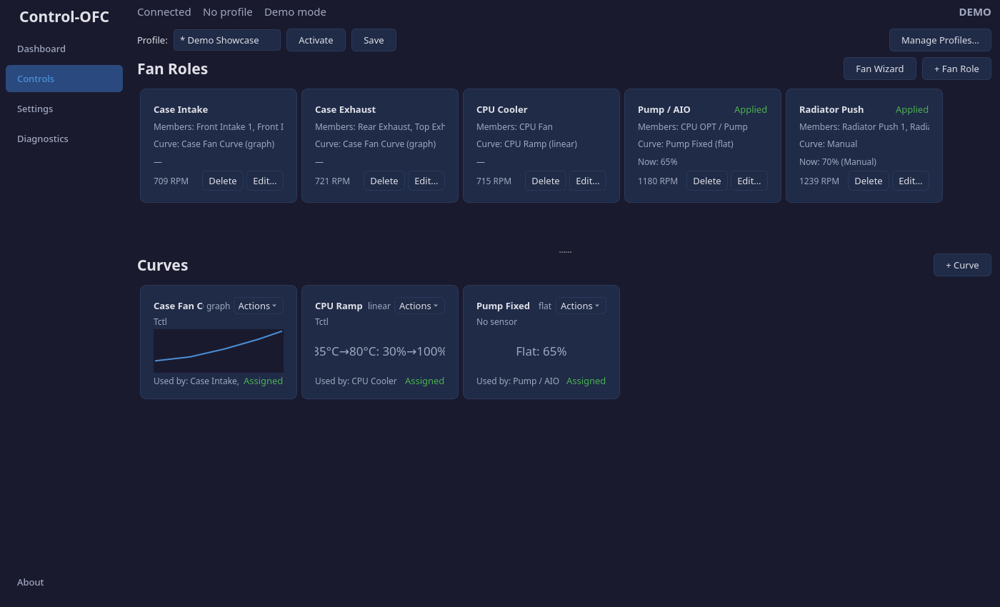
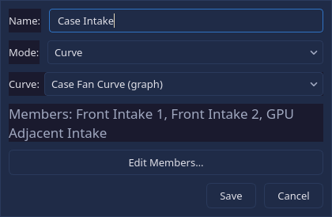
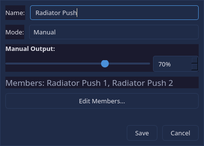
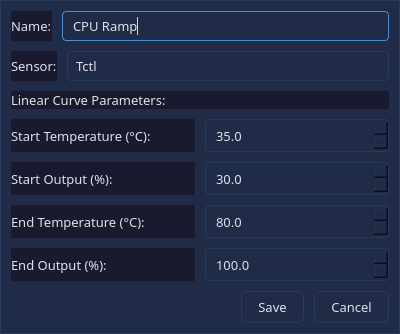

# Controls

The Controls page is the operational heart of the application. It manages **profiles**, **fan roles**, and **curves** — the three layers that determine how your fans respond to temperature.

## How It Works

The control model has three layers:

1. **Profile** — A named collection of fan roles and curves. You switch between profiles (e.g., "Quiet" for nighttime, "Performance" for gaming).
2. **Fan Role** — A logical group of physical fans that share the same behaviour (e.g., "Case Intake" groups your three front fans together).
3. **Curve** — A temperature-to-speed mapping that defines how fast fans should spin at any given temperature.

A profile contains one or more fan roles, and each fan role references a curve from the profile's curve library.

## Profile Bar

The top bar manages profiles:

| Action | What it does |
|--------|-------------|
| **Profile dropdown** | Select which profile to view and edit |
| **New** | Create a blank profile |
| **Duplicate** | Copy the current profile under a new name |
| **Rename** | Change the current profile's name |
| **Delete** | Remove the current profile |
| **Activate** | Make this profile the active one (starts controlling fans) |

An "unsaved changes" indicator appears when you have modified a profile but not yet saved.

## Fan Roles (Top Section)

Each fan role appears as a card showing its name, mode, assigned curve, current output percentage, and member fans.

### Editing a Fan Role

Click any fan role card to open the edit dialog:

| Field | Description |
|-------|-------------|
| **Name** | A human-readable label for this group (e.g., "Case Intake", "CPU Cooler") |
| **Mode** | **Curve** (automatic, temperature-driven) or **Manual** (fixed speed) |
| **Curve** | Which curve to follow (only shown in Curve mode) |
| **Manual Output** | Fixed speed percentage with a slider (only shown in Manual mode) |
| **Members** | Which physical fan outputs belong to this group |

### Managing Members

Click **Edit Members** to open the member assignment dialog. It shows two lists:

- **Available Outputs** — Fan outputs not yet assigned to any role
- **Selected Members** — Fans currently in this role

Move fans between lists with Add/Remove buttons. Each physical fan output can only belong to one role at a time.

### Creating and Removing Roles

- Click **+ Fan Role** to add a new empty role
- Right-click a role card for options: Copy, Duplicate, Delete

## Curves (Bottom Section)

The curve library appears in the lower half. Each curve card shows its name, type, sensor target, and a mini preview of the curve shape.

### Curve Types

| Type | Description | Use Case |
|------|-------------|----------|
| **Graph** (Freeform) | Multiple draggable points defining a custom temperature-to-speed curve | Full control over the response shape |
| **Linear** | Two-point ramp: start temp/speed to end temp/speed | Simple "ramp up between X and Y" |
| **Flat** | Constant output regardless of temperature | Pumps, AIO coolers, always-on fans |

### Editing Curves

Click a curve card to open its editor:

- **Graph curves** open an inline visual editor with draggable points and a numeric table
- **Linear and Flat curves** open a parameter dialog

Each curve has a **sensor selector** — this determines which temperature reading drives the curve. For example, a CPU cooler curve should be driven by the CPU temperature sensor.

### Creating and Removing Curves

- Click **+ Curve** to add a new curve to the library
- Right-click a curve card for options: Edit Parameters, Duplicate, Delete

## Manual Override

When a fan role is set to Manual mode, the control loop stops evaluating its curve and instead writes a fixed PWM percentage. This is useful for:

- Testing specific fan speeds
- Temporarily overriding curve behaviour
- Running fans at a constant speed (e.g., for a pump)

Switching back to Curve mode or changing profiles exits manual override.

---

Previous: [Dashboard](/manual/dashboard.md) | Next: [Settings](/manual/settings.md)
