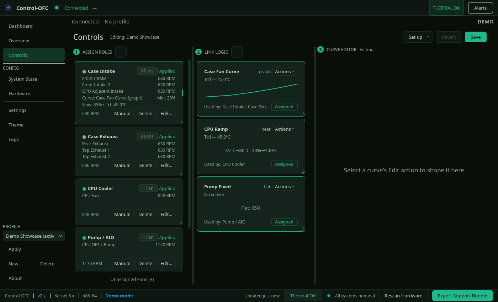
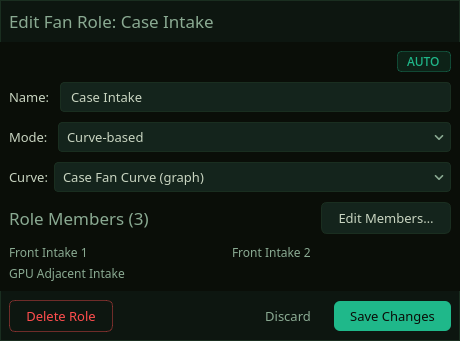
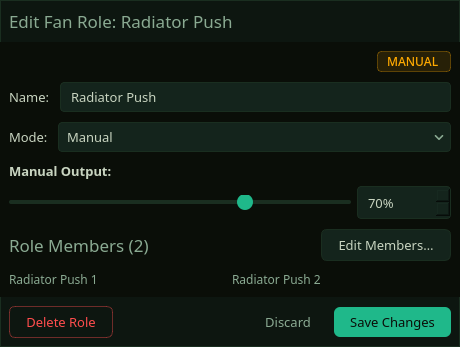
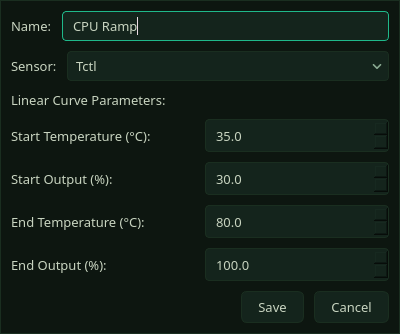

# Controls

The Controls page is the operational heart of the application. It manages **profiles**, **fan roles**, and **curves** — the three layers that determine how your fans respond to temperature.

## How It Works

The control model has three layers:

1. **Profile** — A named collection of fan roles and curves. You switch between profiles (e.g., "Quiet" for nighttime, "Performance" for gaming).
2. **Fan Role** — A logical group of physical fans that share the same behaviour (e.g., "Case Intake" groups your three front fans together).
3. **Curve** — A temperature-to-speed mapping that defines how fast fans should spin at any given temperature.

A profile contains one or more fan roles, and each fan role references a curve from the profile's curve library. The [Profiles and Curves Reference](profiles-and-curves.md) explains the model in depth.

## Page Layout

The page **header** carries the actions that apply to the whole profile:

| Control | What it does |
|--------|-------------|
| *Profile name* | A read-only label naming the profile these edits and **Save** apply to. Selection itself is sidebar-owned, so this is how you confirm what **Save** will write to |
| **⋮** | Profile-management menu (create / rename / duplicate / delete) |
| **Set up ▾** | The hardware-setup menu. It always offers **Auto-Connect Wizard…**, which opens the Fan Wizard to identify and label your physical fans (see [Fan Wizard](fan-wizard.md)). Two further entries appear only when the matching hardware is detected: **Configure AIO…**, one-click liquid-cooler setup (see [Configuring an AIO](#configuring-an-aio--liquid-cooler)), and **Dedicate GPU Fan…**, one-click setup so a writable AMD GPU fan can idle at true 0 RPM (see [Dedicating a GPU fan](#dedicating-a-gpu-fan)) |
| **Revert** | Discards unsaved changes and restores the last saved version of the profile. Enabled only while there are unsaved edits |
| **Save** | Writes the profile's changes to disk (`Ctrl+S`); saving the active profile also re-applies it to the daemon |
| *Unsaved chip* | A warning chip that appears beside **Save** while the profile has unsaved edits |

Below the header the page is a **three-pane** workspace:

1. **Assign Roles** (left) — the fan-role cards; the pane header's **+** button creates a role.
2. **Link Logic** (middle) — the curve library; the pane header's **+** button adds a curve.
3. **Curve Editor** (right) — an always-mounted inline editor. Its header carries a **Test Curve** button, and until you pick a curve it reads *"Select a curve's Edit action to shape it here."*

(The earlier top-section / bottom-section split with a draggable divider is gone — roles, curves, and the editor now sit side by side.)

## Managing Profiles

**Selecting and activating** a profile no longer happens on this page — it moved to the sidebar's **Active Profile** selector (a dropdown plus an **Apply** button). Pick a profile there and click **Apply** to hand it to the daemon, whose profile engine then evaluates its curves every second and drives the fans, so they stay controlled even with the GUI closed. If the Controls page has unsaved edits when you switch the active profile from the sidebar, the GUI first asks whether to discard them — cancel, and the sidebar snaps back to the profile that is still active.

**Saving** stays on this page. The header **Save Profile** button (`Ctrl+S`) writes your changes to disk. Saving the **active** profile also re-applies it to the daemon, so an edited curve takes effect immediately instead of only on the next activation. A status chip beside the button reads **"Unsaved changes"** whenever you have modified a profile without saving, then confirms afterwards: "Settings saved" for an inactive profile, "Saved & reapplied to daemon" for the active one (or "Saved — reapply failed (see log)" if the daemon rejects the re-apply — your local edit is still kept), and "Saved locally — daemon offline, not published" when the daemon is unreachable.

**Creating, renaming, duplicating, and deleting** profiles live under the header's **⋮** menu — **New Profile**, **Rename Profile**, **Duplicate Profile**, and **Delete Profile**. Deleting a profile asks for confirmation and cannot be undone; deleting the currently active profile deactivates it on the daemon first.

The daemon is the store of record for profiles; the GUI keeps a local draft cache so you can author and edit while disconnected. A profile saved while the daemon is unreachable is held as a **draft**; there is no background auto-sync — open it and **Save** again once the daemon reconnects to publish it. Activation (from the sidebar) is disabled while disconnected — you cannot make a profile active until the daemon can receive it.

## Fan Roles (Assign Roles)

The left **Assign Roles** pane lists your fan roles. Its **+** button offers two kinds of role:

- **Single Output Fan Role** — one physical output
- **Group Fan Role (Multi-Fan)** — several outputs acting together

Each fan role appears as a card:

| Card element | Meaning |
|--------------|---------|
| **Title row** | Role name plus a status chip: **Applied** (curve output being written), **Manual** (your own inline override active), **External** (an override held by something else — another client, or this app before it restarted), **Not controlled** (the daemon cannot work out a speed for this role, so nothing is driving these fans and they hold their last speed — hover for the reason), or **No members** |
| **Members** | The physical outputs in the role — "Members: Front Intake 1, Front Intake 2, +1 more" |
| **Curve** | The assigned curve and its type, or "Curve: Manual" for fixed-speed roles. A **Min: N%** badge appears when a stall-protection floor applies (see [role-aware minimums](profiles-and-curves.md#role-aware-minimum-stall-protection)) |
| **Now** | Live output and the driving sensor: "Now: 65% • Tctl 45.0°C". Mixed roles with a GPU member also show the GPU's own value ("(GPU 0%)") when it idles below the rest |
| **Bottom row** | Measured RPM on the left; **Manual**, **Delete**, and **Edit…** buttons on the right |

### Configuring an AIO / liquid cooler

**Configure AIO** lives in the **Set up ▾** menu in the page header. It sets your cooler up in one step:

- A **pump** control, driven one of three ways. **Automatic** (the default) follows temperature on a gentle curve; **Fixed speed** holds one level — Low (30%), Mid (60%), High (80%), or Max (100%); **Custom curve** starts from the automatic curve and opens the editor. Whichever you choose, the pump is never driven below 30%.

  Which is right depends on your cooler, and there is no universal answer — check its documentation. Many pumps are happiest at a steady speed; some vendors recommend the opposite for their own hardware, and at least one ignores PWM below 20% and boosts itself when the coolant gets hot regardless of what you ask for.
- A **radiator-fan** control bound to a temperature sensor — the **coolant** sensor by default (recommended, since the radiator's job is to cool the loop), though any sensor is selectable and coolant/CPU are highlighted as preferred. If your machine has no coolant sensor, CPU package temperature is used instead; that is normal, not a problem to fix.

### If your AIO is plugged into the motherboard

A USB cooler (NZXT Kraken, Aquacomputer) identifies itself, so its pump is found automatically. A pump plugged into an **AIO_PUMP** or **CPU_OPT** header on the motherboard cannot be: it looks exactly like any other fan to the system, and on many boards the chip publishes no channel names at all, so every header reads as "unknown".

So Configure AIO **asks**. Its first step lists your controllable headers and you pick the one the pump is on. If you are not sure, use the **Fan Wizard** first to identify each header, then come back.

Telling it which header is the pump is worth doing even if you do not change anything else — it is what earns that header its 30% minimum speed, and what stops it being stopped during fan identification. Choose "No pump on a motherboard header" if your pump is not connected this way, and only the radiator fans are set up.

The dialog also asks what to **name** the cooler. The name is presentation only — it does not change how the pump or fans are controlled — but it is what lets Control-OFC treat the pump, its radiator fans and its temperature source as one cooling device rather than three unrelated channels. Naming confers nothing on its own: the 30% minimum and identify protection come from telling it which header is the pump, above.

A read-only / monitor-only cooler (one whose pump the kernel cannot drive, such as an older NZXT Kraken2) skips the pump step and offers radiator + coolant monitoring only — it never offers control that would fail. The controls it creates are ordinary fan roles you can edit afterward.

### Dedicating a GPU fan

When a writable, zero-RPM-capable AMD GPU is detected, a **Dedicate GPU Fan** button appears in the page header. Use it to let the GPU fan idle at **true 0 RPM** when the card is cool. In one step it:

- pulls the GPU fan out of any role that currently drives it, and creates a **GPU-only** role — because that role holds only the GPU, its curve can be drawn all the way down to 0% (no chassis/CPU stall-protection minimum applies);
- binds a dedicated curve to a **GPU temperature** sensor (edge/junction preferred) — the default idles at 0% up to 45 °C, then ramps (20% / 40% / 60% / 100% at 47 / 58 / 75 / 95 °C);
- turns on the GPU firmware's **zero-RPM idle stop** for that fan.

That last step is the important one: a 0% point on the curve alone is *not* enough — the GPU firmware raises a bare 0% command up to its own minimum (~15%), so the fan keeps spinning. True 0 RPM comes from the zero-RPM stop, which the firmware releases as soon as the GPU warms and the curve ramps up. The daemon restores automatic zero-RPM control when it shuts down. In the dialog you pick the sensor and can un-tick zero-RPM to keep the fan always spinning at the firmware minimum instead.

This is the one-click equivalent of building a GPU-only role by hand and ticking **Allow zero-RPM idle** in the [role dialog](#editing-a-fan-role).

### Inline Manual Override

The **Manual** button on each card is a toggle: switch it on and a slider replaces the output line, pinning that role's fans to a fixed speed. This asks the **daemon** to override that role — the daemon, not the GUI, enforces the fixed speed and reverts to the curve when you are done. It is a *temporary* override:

- it overrides **that role only** — every other role keeps following its curve
- it is **floor-clamped** — the requested speed is raised to the role's stall-protection minimum if you ask for less (see [role-aware minimums](profiles-and-curves.md#role-aware-minimum-stall-protection))
- it is **expiring** — the GUI keeps the override alive while the slider is up; if the GUI closes or stops renewing it, the daemon lets the override lapse and the curve resumes on its own
- it is **not saved** to the profile, and it clears the moment you toggle it off or switch profiles — the daemon snaps that role straight back to its curve
- if the daemon **refuses** the override — thermal safety is holding the fans, or another client superseded your control — the card reverts and the page status shows why ("Override blocked — thermal emergency…" or "Override superseded by another client"); a normally-lapsing override just reverts quietly

Use it for quick experiments ("what does 80% sound like?") without touching the saved profile. To make a role *permanently* fixed-speed, set its mode to Manual in the Edit dialog instead.

### Editing a Fan Role

Click **Edit…** to open the role dialog:

| Field | Description |
|-------|-------------|
| **Name** | Human-readable label ("Case Intake", "CPU Cooler") |
| **Mode** | **Curve** (automatic, temperature-driven) or **Manual** (fixed speed, stored in the profile) |
| **Curve** | Which curve to follow (Curve mode only) |
| **Manual Output** | Fixed percentage with slider and spinbox (Manual mode only) |
| **Members** | Read-only summary, with an **Edit Members** button |

When the role contains an AMD GPU fan, a **GPU fan idle behaviour** section appears with a per-GPU **Allow zero-RPM idle** checkbox: leave it checked to let the GPU's firmware stop the fan at idle (it spins up with the curve), or uncheck it so the fan tracks the curve continuously. For a fresh setup, the header's [**Dedicate GPU Fan**](#dedicating-a-gpu-fan) button does this for you in one step (GPU-only role + 0%-capable curve + zero-RPM enabled).

### Managing Members

**Edit Members** shows two lists — available outputs and selected members — with **>** / **<** buttons to move fans between them. Entries are tagged by source (`[openfan]`, `[hwmon]`, `[amd_gpu]`).

Each physical fan can belong to **only one role**: outputs already assigned elsewhere appear greyed out with "(Assigned to: …)" so you can see which role owns them. Read-only GPU fans are marked "(read-only)".

### Arranging and Resizing Cards

- **Drag a card** to reorder it within its section (a drop indicator shows the insertion point); the order is saved with the profile.
- **Drag the grip** in a card's bottom-right corner to resize it — sizes snap to a shared 20px grid, so making several cards exactly the same size is easy. **Double-click the grip** to reset the card to its theme-derived size. Per-card sizes persist across restarts and profile switches.
- The baseline card size follows the theme font size and the **Card size** preference (Compact / Comfortable / Large) on the [Theme page](settings.md#theme-page).

## Curves (Link Logic)

The curve library is the middle **Link Logic** pane. Its **+** button offers the seven curve types:

| Type | Description | Use case |
|------|-------------|----------|
| **Graph Curve** | Multiple draggable points defining a custom temperature-to-speed shape | Full control over the response |
| **Stepped Curve** | The same draggable points as a graph, but the output *holds* each point's value until the next point's temperature is reached — a staircase, not a ramp | A fixed fan speed per temperature band, with fewer speed changes |
| **Linear Curve** | Two-point ramp: start temp/speed to end temp/speed | Simple "ramp up between X and Y" |
| **Flat Curve** | Constant output regardless of temperature | Always-on fans, and pumps you want held at one speed |
| **Trigger Curve** | A two-state latch: an idle speed below the idle temperature, a load speed above the load temperature, holding its state in between (its own hysteresis) | "Stay quiet, then ramp hard past X°" |
| **Mix Curve** | Combines several *other* curves — each evaluated at its own sensor — into one output using a function: **Max**, **Min**, **Average**, **Sum**, or **Subtract** (result clamped 0–100%). Has no sensor of its own | "Drive this fan from whichever of CPU/GPU/VRM is hottest" |
| **Sync Curve** | Mirrors another fan role's current output, plus an optional offset (−100…+100%). Has no sensor of its own | "Keep the rear fans a few percent above the front fans" |

Mix and Sync are *composite* curves: they reference other curves (Mix) or another fan role (Sync) **by name**, and the editor only offers choices that cannot form a loop, so a composite can never depend on itself (DEC-150/151/152).

Each curve card shows the curve's name and type, the bound sensor with its live reading (composites show no sensor), a preview, and which roles use it ("Used by: …" with an **Assigned** / **Unassigned** chip). The preview is a sparkline for graph curves, a staircase for stepped curves, and otherwise a short summary — for example "35°C→80°C: 30%→100%", "Flat: 65%", "Idle 30% <40° / Load 80% >60°", "Max of 3 curves" (Mix), or "Mirror control +5%" (Sync). The card's **Actions** menu has **Edit**, **Rename**, **Duplicate**, **Unlink** (detach the curve from every role using it), and **Delete**.

### Editing a Graph or Stepped Curve

**Actions → Edit** on a graph or stepped curve loads it into the always-mounted **Curve Editor** pane on the right (a stepped curve uses the same point editor — only its preview line renders as a staircase):

- **Drag points** on the graph, or type exact values in the numeric table beside it. **Double-click** empty graph space (or click **+ Add Point**) to add a point; **Remove Point** or the `Delete` key removes the selected one (a curve keeps at least 2 points)
- The **sensor selector** chooses which temperature drives the curve; a live readout shows the current evaluation ("45.0°C → 62%")
- **Presets** (Linear, Quiet, Aggressive) load a starting shape you can refine
- **Undo / redo** with `Ctrl+Z` / `Ctrl+Shift+Z`
- The valid range is 0–120°C and 0–100% output; if a role using this curve has a stall-protection minimum, the editor stops you dragging points below that floor
- Edits update the card preview immediately and mark the profile unsaved; the editor header's **Test Curve** button refreshes the live readout so you can check the curve's output at the current sensor temperature. To edit a different curve, pick its **Edit** action — it loads into the same pane

### Editing a Linear, Flat, Trigger, Mix, or Sync Curve

These open a small parameter dialog instead:

- **Linear** — name, a sensor, and start/end temperature and output values.
- **Flat** — just a name and an output percentage (no sensor needed).
- **Trigger** — a sensor plus idle/load temperatures and speeds (the idle temperature must be below the load temperature).
- **Mix** — a combine **function** (Max / Min / Average / Sum / Subtract) and a checklist of **curves to combine**. No sensor: each combined curve evaluates at its own sensor and the results are merged. Only curves that would not create a cycle are offered; if none exist the list reads "No other curves available to combine."
- **Sync** — the fan role to **mirror** and an **offset** percentage (−100…+100). No sensor: the output tracks the chosen role's current value plus the offset. Only roles that would not create a cycle are offered.

## Empty States

A new profile shows "No fan roles configured. Click + to create one." The Curves section stays hidden until at least one fan role exists — curves are always assigned *to* roles, so the page walks you through creating a role first.

---

Previous: [Dashboard](dashboard.md) | Next: [Settings](settings.md)
