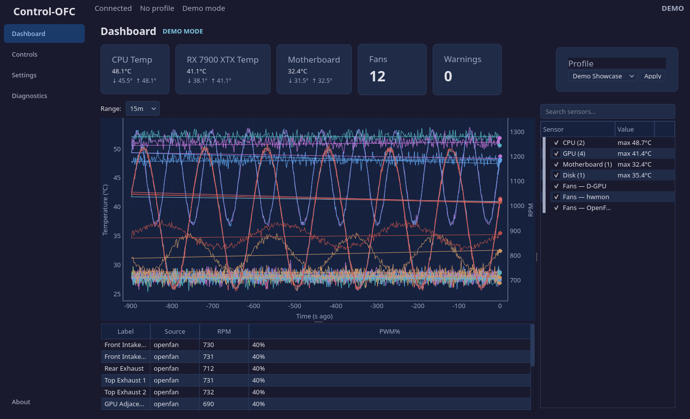

# Dashboard

The Dashboard is the landing page. It answers the most important questions at a glance:

- What profile is active?
- What are the fans doing?
- What are the sensors reading?
- Is the system healthy?

## Summary Cards

The top row shows summary cards for key readings:

| Card | Shows |
|------|-------|
| **CPU Temp** | Hottest CPU sensor value |
| **GPU Temp** | Primary GPU temperature |
| **Motherboard** | Motherboard chipset temperature |
| **Active Profile** | Name of the profile currently controlling fans |
| **Fan Count** | Number of detected controllable fans |
| **Warnings** | Count of active warnings |

You can **click any temperature card** to change which sensor it displays. A picker dialog lets you choose from all available sensors of that type.

## Fan Speed Chart

The timeline chart plots fan RPM over time. It supports multiple time ranges:

| Range | Use Case |
|-------|----------|
| 10s, 30s, 1m | Watching real-time response to load changes |
| 5m, 30m | Observing curve behaviour during a gaming session |
| 1h, 2h, 4h, 12h | Reviewing long-term patterns |

The default time range is configurable in Settings.

### Series Visibility

The legend panel on the right lists every fan. You can:

- **Click a fan name** to show/hide its line on the chart
- **Hide by group** to declutter the view (e.g., hide all hwmon fans)
- **Reset** to show all fans again

Hidden series persist across sessions — your visibility preferences are saved automatically.

## Fan Status Table

Below the chart, a table lists every detected fan with:

| Column | Meaning |
|--------|---------|
| **Name** | User-assigned alias (from Fan Wizard) or hardware ID |
| **Source** | Where the fan is connected: OpenFan, hwmon, or AMD GPU |
| **RPM** | Hardware-measured rotational speed |
| **PWM** | Last commanded speed percentage |

## Profile Selector

The dropdown in the top-right corner lists all available profiles. Selecting a profile here activates it immediately — the daemon begins evaluating curves and writing fan speeds.

## Disconnected / No Hardware States

If the daemon is not reachable, the Dashboard shows a disconnected overlay with a reconnection message. If the daemon is connected but no controllable hardware is detected, it shows a "No hardware" message with a link to Diagnostics.

---

Previous: [Getting Started](/manual/getting-started.md) | Next: [Controls](/manual/controls.md)
