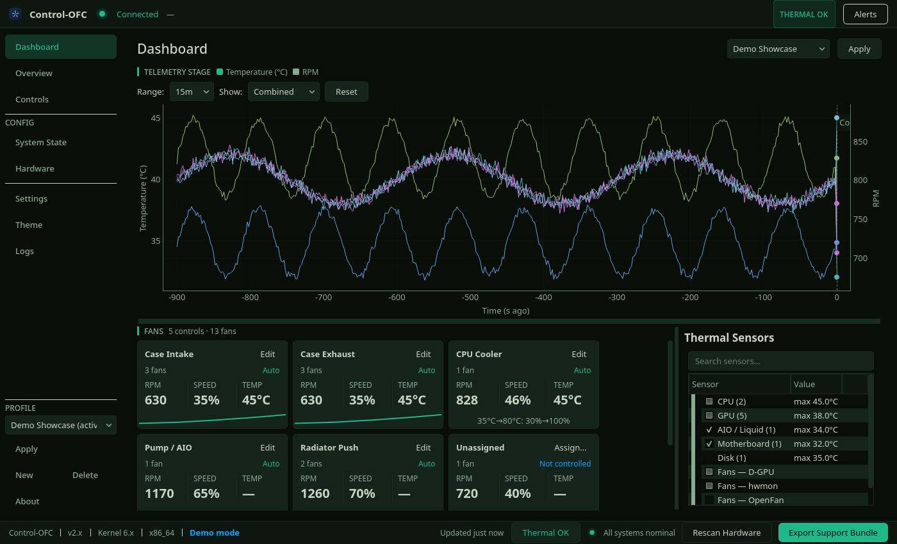

# Dashboard

The Dashboard is the landing page. It answers the most important questions at a glance:

- What profile is active, and what mode is the system in?
- What are the fans doing?
- What are the sensors reading?
- Is the system healthy?

The page leads with the **telemetry chart** — the one view nothing else duplicates —
with a compact **card per fan control** beneath it and the **Thermal Sensors** panel
alongside. Drag the splitter handles to trade space between them.

Status that used to sit on a Dashboard-only strip now lives on the app-wide chrome, so
it follows you to every page: connection, uptime and alerts on the **top ribbon**;
operation mode, poll freshness, thermal safety and cooling readiness on the **footer**.

## Page header

The title row carries a **profile selector + Apply** (see
[Profile Selector](#profile-selector)) so you can switch profiles without leaving the
page. The sidebar has one too — either works.

Below it, three banners appear only when they apply:

- **Motherboard fan headers** are missing or all read-only
- **API version mismatch** — the connected daemon's API version differs from the one
  this GUI was built against, a sign the `control-ofc-daemon` and `control-ofc-gui`
  packages were upgraded out of lockstep. Align the two; some features may otherwise
  misbehave
- **Thermal protection active** — the daemon has overridden fan control to protect the
  hardware, and will hand control back to your profile once temperatures recover

## Fan Cards

Fans are shown as one card per **fan control** — the group a profile assigns a curve
to — rather than one card per individual fan. That mirrors how control actually works:
the daemon pins speeds per control, so a card always tells you **how many fans it
covers**.

Each card shows:

| Field | Meaning |
|-------|---------|
| **State chip** | Auto (the curve is driving it), Override active, Low RPM, Stale, Stall, or Offline — beside the fan count |
| **RPM** | Hardware-measured speed, averaged across the control's fans |
| **SPEED** | Last commanded speed. For a read-only GPU that reports no commanded value, the column is headed **DUTY** instead and shows the firmware's *measured* duty, so a measurement is never read as a speed the daemon commanded |
| **TEMP** | The temperature driving this control's curve |
| **Curve preview** | A sketch of the control's own curve, as a band along the bottom of the card |
| **Edit** | Beside the card's name; opens the **Controls** page focused on this control |

A dash (`—`) means the value is genuinely unknown — it is never shown as a real `0`.

Two special cards fill in the gaps:

- **Unassigned** — controllable fans that no control owns yet. If no profile is
  active, every controllable fan appears here, so a fresh install still shows your
  hardware. Its **Assign…** button opens the Controls page.
- **Read-only fans** — devices with no fan-control write path (typically an NVIDIA or
  read-only GPU fan) get a card each, so you can still read their speed. They have no
  Edit button, because they cannot be assigned to a control.

> **The cards are read-only.** Changing a speed happens on the **Controls** page,
> which owns manual override; the Dashboard shows you what is happening and takes you
> there.

## Telemetry Chart

The timeline chart is **dual-axis**: temperatures plot against the left axis (°C) and
fan RPM against the right axis, so you can watch a temperature rise and the fans
respond on one graph.

To keep it readable, the chart **does not show every series at once**. On first run it
shows a curated default — CPU temp, GPU temp, and one case/motherboard temp. From there
you control what's shown:

- **Chart modes** — a selector switches between **Combined** (the curated default),
  **Thermals**, **Fans**, and **Diagnostics**, with a **Reset** to return to defaults.
- **Series selection** — toggle individual sensors and fans on or off from the
  **Sensors** panel's checkboxes (see [Sensors panel](#sensors-panel)).
- **Event annotations** — vertical markers flag transitions the GUI detects between
  polls: a profile change, a reconnect, a thermal transition, an override starting or
  ending, and the onset of a stale sensor or a stalled fan.

The **Range** dropdown selects the time window:

| Range | Use Case |
|-------|----------|
| 30s, 2m | Watching real-time response to load changes |
| 5m, 10m, 15m, 20m, 30m | Observing curve behaviour during a gaming session |
| 1h, 2h | Reviewing longer-term patterns |

The default time range (15m) is configurable in Settings. Each visible series carries a
coloured **latest-value marker** on the right edge, and **hovering** the chart shows a
crosshair and a themed tooltip listing every series value at that moment. The
tooltip-plate and crosshair colours are themeable on the **Theme** page.

## Sensors panel

The right-hand **Sensors panel** is always present — drag the splitter handle between
it and the fan cards to give the chart more width when you need it. It is a grouped,
searchable tree of every **sensor and fan**, grouped
into CPU, GPU, **AIO / Liquid** (liquid-cooler coolant temperatures), Motherboard, Disk,
and Fans (by source: D-GPU, hwmon, OpenFan). Liquid-cooler pump and radiator fans are
tagged **(AIO)**. Type in the "Search sensors…" box to filter; click a row's checkbox to
show/hide its line on the chart; toggle a whole group to declutter. Hidden series persist
across sessions.

### Naming your fans

OpenFan channels arrive with no name of their own, so they start out as
**OpenFan CH0**, **OpenFan CH1** and so on. To give one a name that means
something — "Front Intake", "Radiator Push" — **double-click it** in the Sensors
panel (or select it and press **F2**, or right-click it and choose
**Rename fan…**). The name applies everywhere at once: fan cards, the Overview
table, curve and fan-role pickers.

To go back to the default name, clear the text and press Enter, or right-click and
choose **Reset to default name**. Pressing Enter without changing anything does
nothing at all — it will not quietly turn the displayed name into a custom one.

Two things worth knowing:

- The **(AIO)** tag is not part of the name. You do not need to type it and you
  cannot remove it by renaming — it marks a fan the daemon reports as belonging to
  a liquid cooler.
- Naming a fan also keeps it on screen when **Hide unused fan headers** is on, so
  a header that is idle right now stays visible once you have named it. Clearing
  the name lets it drop out of the list again.

If you already named your fans while setting them up in a profile, those names are
picked up automatically the first time this version runs — you do not need to
retype anything. From then on the name lives with the fan, so renaming it here
updates the Controls page too.

To work out which physical fan is which before naming them, use the
**Fan Configuration Wizard** on the [Controls page](controls.md) — it stops one
fan at a time so you can see which one slows down.

> In demo mode you can rename fans to try the feature out, but the names are not
> saved — demo hardware is not real, and your actual fan names are left untouched.

> Both the **event log** and the **active warnings** list live on the
> [Logs page](diagnostics.md), side by side — the event feed is history, the warnings
> list is what is wrong right now. Use the profile selector in the page header to
> switch profiles.

## Profile Selector

The profile selector in the page header lists all available profiles (the sidebar
carries the same selector). Pick one and click **Apply** to activate it. Activating hands the profile to the daemon, whose
profile engine then evaluates its curves every second and drives the fans — so your
fans stay controlled whether the GUI is open or closed. See
[The Daemon Drives the Fans](profiles-and-curves.md#the-daemon-drives-the-fans).

## Thermal Safety States

If the daemon engages its thermal failsafe (a CPU sensor at ≥ 105°C, or no CPU sensor
found), the daemon forces OpenFan and writable hwmon fans itself and holds them until
it reports normal again. This shows in the footer's **thermal state** chip (click it
for the detail) and as a banner across the top of the Dashboard, and raises a warning
(visible in the footer health rollup and the Logs page's Active Warnings list). See
["Fans run at full speed regardless of profile"](hardware-troubleshooting.md#fans-run-at-full-speed-regardless-of-profile)
for the full behaviour.

## Disconnected / No Hardware States

If the daemon is not reachable, the Dashboard shows a disconnected overlay with a
reconnection message. If the daemon is connected but no controllable hardware is
detected, it shows a "No hardware" message with a button that opens the **Hardware**
page's readiness report, which names the driver or package your board needs.

---

Previous: [Setup Checklist](setup-checklist.md) | Next: [Controls](controls.md)
