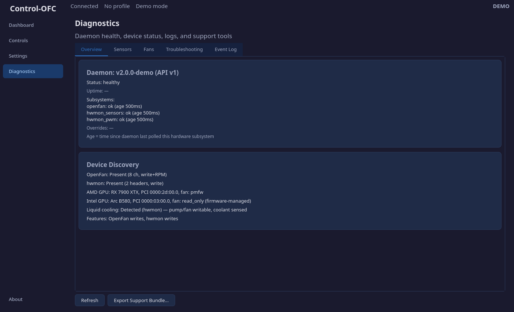
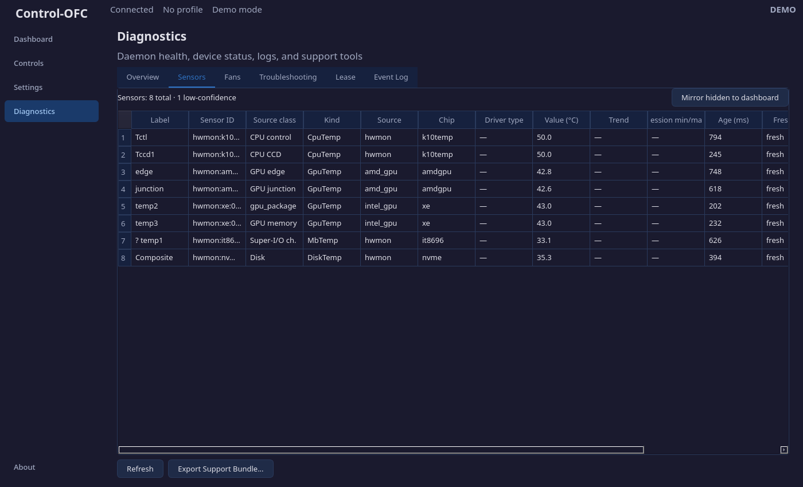
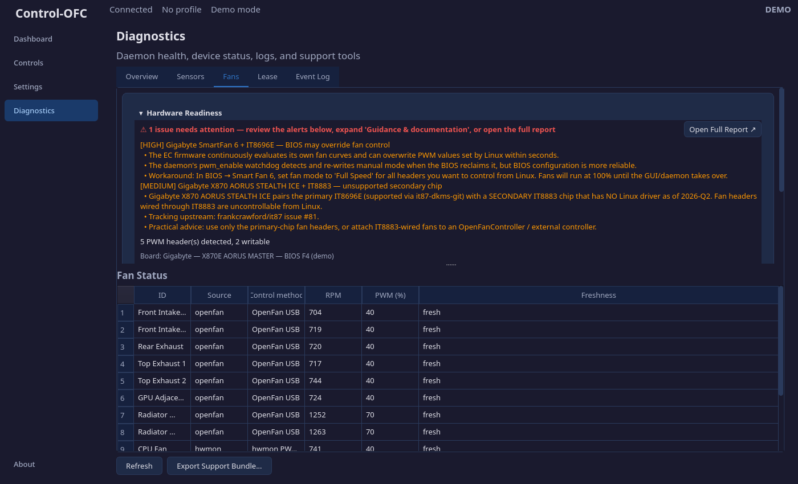
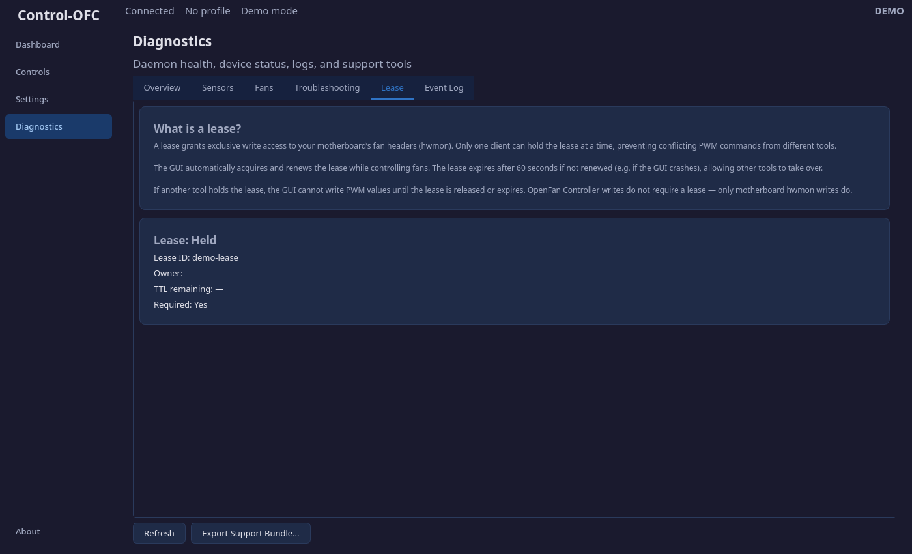
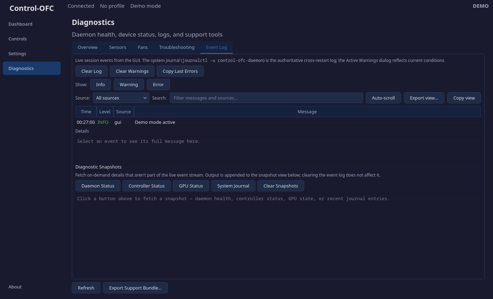

# Diagnostics

The Diagnostics page exposes the health and status of every subsystem. It is your primary tool for troubleshooting connection issues, stale sensors, lease conflicts, and hardware detection problems.

## Overview Tab

Two information cards:

### Daemon Health

| Field | Meaning |
|-------|---------|
| **Daemon version** | Version of the running daemon and its API |
| **Status** | Overall health: "healthy", "warning", or "critical" |
| **Uptime** | How long the daemon has been running since last restart |
| **Subsystems** | List of subsystems (openfan, hwmon_sensors, hwmon_pwm) with their status and age |

**Age** is the time in milliseconds since the daemon last polled that hardware subsystem. A low age (under 1000ms) means the data is fresh. A high age means the daemon is having trouble reaching that hardware.

### Device Discovery

| Field | Meaning |
|-------|---------|
| **OpenFan** | Whether an OpenFan Controller is detected, channel count, and write/RPM capability |
| **hwmon** | Whether motherboard fan headers are detected, header count, and whether writes require a lease |
| **AMD GPU** | Whether a discrete GPU is detected, its model, PCI address, and fan control method |
| **Features** | Summary of write capabilities (OpenFan writes, hwmon writes) |

## Sensors Tab

A table of every temperature sensor reported by the daemon:

| Column | Meaning |
|--------|---------|
| **Label** | Human-readable sensor name (e.g., "CPU Tctl", "GPU Edge") |
| **Kind** | Sensor category: CpuTemp, GpuTemp, MbTemp, DiskTemp, etc. |
| **Value** | Current temperature reading in degrees Celsius |
| **Age (ms)** | Time since the daemon last read this sensor |
| **Freshness** | "fresh" (under 2s), "stale" (2-10s), or "invalid" (over 10s) |

Stale sensors appear in yellow. Invalid sensors appear in red. This helps identify hardware that has stopped responding.

## Fans Tab

A table of every controllable fan output:

| Column | Meaning |
|--------|---------|
| **ID** | Display name (user alias if set, otherwise hardware ID) |
| **Source** | Connection type: openfan, hwmon, or amd_gpu |
| **RPM** | Hardware-measured speed (dash if not available) |
| **PWM (%)** | Last commanded speed percentage (dash if not set) |
| **Freshness** | Data freshness indicator, same as the sensors table |

## Lease Tab

### What is a Lease?

A lease grants exclusive write access to your motherboard's fan headers (hwmon). Only one client can hold the lease at a time, preventing conflicting speed commands from different tools.

The GUI automatically acquires and renews the lease while controlling fans. The lease expires after 60 seconds if not renewed (e.g., if the GUI crashes), allowing other tools to take over.

OpenFan Controller and GPU fan writes do **not** require a lease — only motherboard hwmon writes do.

### Lease Status

| Field | Meaning |
|-------|---------|
| **Lease** | "Held" or "Not held" |
| **Lease ID** | Unique identifier of the current lease |
| **Owner** | Which client holds the lease (e.g., "gui") |
| **TTL remaining** | Seconds until the lease expires if not renewed |
| **Required** | Whether any detected hardware requires a lease for writes |

If another tool (or another instance of Control-OFC) holds the lease, the GUI cannot write PWM values until the lease is released or expires.

## Event Log Tab

A timestamped log of events, warnings, and errors. The log retains up to 2000 entries.

### Detail Buttons

The top row provides on-demand detail fetches:

| Button | What it Fetches |
|--------|----------------|
| **Daemon Status** | Current daemon health snapshot formatted as text |
| **Controller Status** | OpenFan controller detection and capability details |
| **GPU Status** | AMD GPU detection, fan capabilities, and current fan state |
| **System Journal** | Recent entries from the `control-ofc-daemon.service` systemd journal |

### Log Controls

| Button | Action |
|--------|--------|
| **Refresh Log** | Reload the event list |
| **Clear Log** | Remove all entries from the display |
| **Clear Warnings** | Reset the warning counter shown in the status banner |
| **Copy Last Errors** | Copy recent errors and warnings to the clipboard for sharing |

## Export Support Bundle

The **Export Support Bundle** button (below all tabs) creates a JSON file containing:

- System configuration
- Daemon status and version
- Sensor and fan states
- Event log entries
- Active profile information

This file is useful for reporting issues. Review it before sharing — it may contain system-specific details.

---

Previous: [Settings](/manual/settings.md) | Next: [Fan Wizard](/manual/fan-wizard.md)
