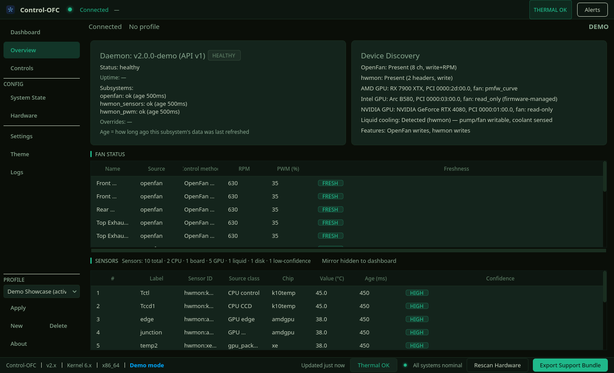
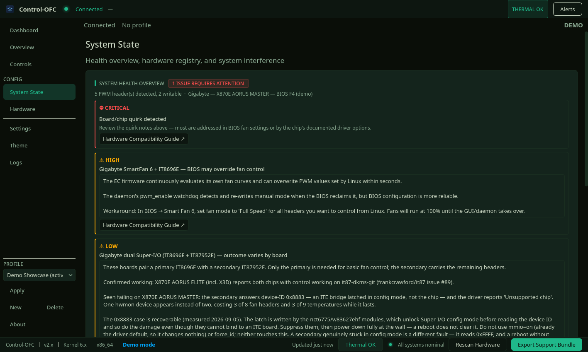
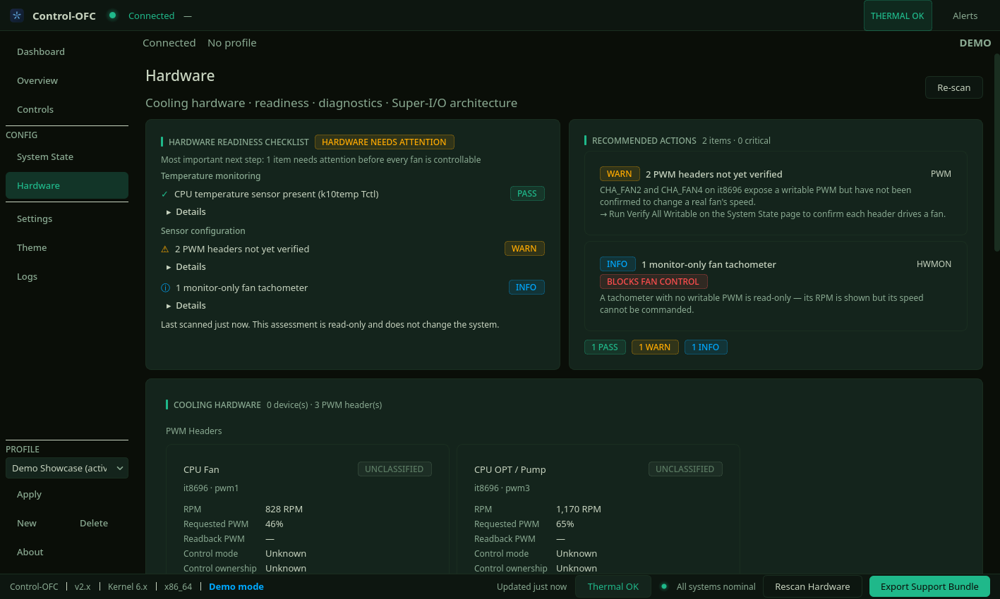
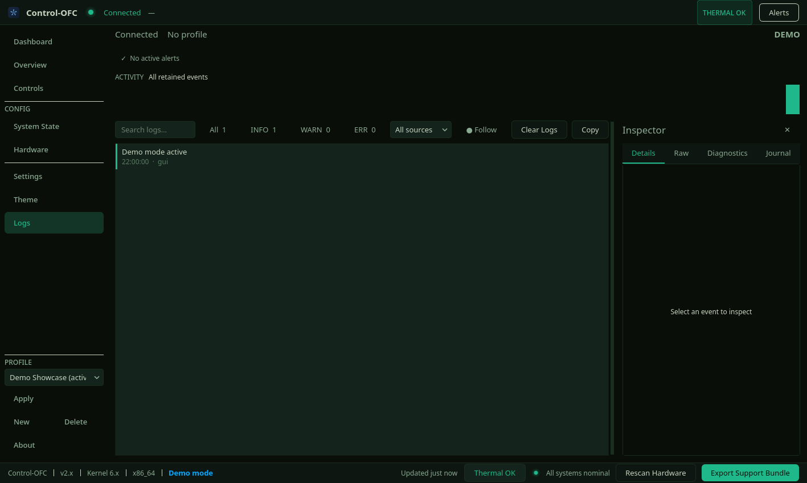

# System Health (Overview, System State, Hardware & Logs)

The application spreads the health and status of every subsystem across four standalone sidebar pages — **Overview**, **System State**, **Hardware**, and **Logs**. Together they are your primary tools for troubleshooting connection issues, stale sensors, and hardware detection problems. (In earlier versions these were tabs on a single **Diagnostics** page; that tabbed page was retired in the redesign and its content re-homed onto the four pages documented below.)

> **Looking for help with a specific motherboard or fan controller?** Start with the [Hardware Troubleshooting](hardware-troubleshooting.md) page — it covers the Hardware Readiness checks on the **System State** page, Test PWM Control, vendor quirks, and what to do when fans report 0 RPM or refuse to change speed.

## Overview page

The **Overview** page answers *"is the daemon healthy, what hardware was found, and what are the sensors and fans doing?"*. It opens with two information cards — **Daemon Health** and **Device Discovery** — followed by the **Sensor Intelligence** and **Fan Status** sections.

### Daemon Health

| Field | Meaning |
|-------|---------|
| **Daemon version** | Version of the running daemon and its API |
| **Status** | Overall health: "healthy", "warning", or "critical" |
| **Uptime** | How long the daemon has been running since last restart |
| **Subsystems** | List of subsystems (openfan, hwmon_sensors, hwmon_pwm) with their status and age |

**Age** is the time in milliseconds since the daemon last polled that hardware subsystem. A low age (under 1000ms) means the data is fresh. A high age means the daemon is having trouble reaching that hardware.

### Device Discovery

| Field | Meaning |
|-------|---------|
| **OpenFan** | Whether an OpenFan Controller is detected, channel count, and write/RPM capability |
| **hwmon** | Whether motherboard fan headers are detected, the header count, and their write capability |
| **AMD GPU** | Whether an AMD discrete GPU is detected, its model, PCI address, and fan control method (`pmfw` or legacy `pwm1`) |
| **Intel GPU** | Whether an Intel Arc discrete GPU is detected, its model, and PCI address. Intel GPU fans are always reported `read_only (firmware-managed)` — the `xe`/`i915` drivers expose no fan-control path |
| **NVIDIA GPU** | Whether an NVIDIA discrete GPU is detected (via the open `nouveau` driver or the opt-in NVML backend), its model, driver, and PCI address. NVIDIA GPU fans are always reported `read-only` — `nouveau`'s writable `pwm1` is excluded for safety and the NVML backend is telemetry-only |
| **Liquid cooling** | Whether a liquid cooler (AIO) is detected via hwmon, and whether its pump/fan is writable, monitor-only (a read-only driver such as NZXT Kraken2), or not detected. USB-only coolers are out of scope and shown as not detected |
| **Features** | Summary of write capabilities (OpenFan writes, hwmon writes) |

### Sensor Intelligence

An 8-column diagnostic table of every temperature sensor reported by the daemon (`#`, Label, Sensor ID, Source class, Chip, Value, Age, Confidence — right-click a row for the full detail dialog). A **header summary line** above the table answers "is anything wrong?" at a glance — `Sensors: N total · X CPU · Y board · Z GPU · W disk · K stale · J low-confidence · U unavailable · M hidden`.

| Column | Meaning |
|--------|---------|
| **Label** | Sensor label reported by the kernel driver (e.g., "Tctl", "edge"). Prefixed with `⚠ ` for a sensor with a documented bogus-quirk (e.g. the ASUS NCT6776F `CPUTIN` case) and `? ` for a low-confidence classification |
| **Sensor ID** | Stable identifier (e.g. `hwmon:<chip>:<dev_id>:<label>`) — the id profiles use to bind a curve to this sensor |
| **Source class** | Fine-grained classification from the sensor knowledge base (`cpu_die`, `vrm`, `board_thermistor`, `gpu_package`, …) |
| **Source** | Daemon source subsystem: `hwmon`, `amd_gpu`, `intel_gpu`, or `nvidia_gpu` |
| **Chip** | Kernel driver / chip providing the reading (e.g., `k10temp`, `nct6798`, `amdgpu`, `xe`) |
| **Value (°C)** | Current temperature in °C. Suffixed `⚠ ALARM` when the daemon reports a critical alarm or the live value has crossed the reported critical threshold |
| **Session min/max** | Lowest and highest values observed since the daemon started |
| **Age (ms)** | Time since the daemon last read this sensor |
| **Confidence** | How certain the GUI is about how to interpret this sensor: `high`, `medium`, `low`, or `unknown`. Lower confidence usually means the sensor's chip has known quirks (e.g., the ASUS NCT6776F `CPUTIN` reading is a board temperature, not the CPU) |
| **Details** | A per-row button that opens the **Sensor Detail** dialog |

The `K stale` count on the header summary line is the quick check for sensors that have stopped updating. Per-sensor kind, driver type, trend, and freshness are not table columns — open the row's **Details** dialog to see them (trend also appears in the hover tooltip).

#### Unavailable sensors

Some sensors exist but currently can't be read at all — the classic example is a Wi-Fi-radio temperature (an `ath12k` chip) that returns "Network is down" whenever the radio is switched off. Rather than letting the daemon log that failure endlessly, these are reported as **unavailable** and listed in a small panel below the table: each shows its label, the read-error reason, and how long it has been unavailable, and the count appears as `· U unavailable` on the header summary line. The panel is hidden entirely when nothing is unavailable. Because such a sensor can disappear the moment its device powers down, it is **never offered as a fan-curve source** in the Controls page (a curve already bound to one keeps working). This is display-only — there is no banner or pop-up — and an unavailable sensor re-appears in the table automatically the moment it becomes readable again.

#### Sensor Detail dialog

Open it via the per-row **Details** button, a row double-click, or right-click → **Open detail…**. It shows the full classification description and every classification note (not truncated like the hover tooltip), board context, a **Thresholds** section with a headroom-to-critical indicator, and a clickable kernel.org driver documentation link. On a daemon that reports its own classification (≥ v2.6.0), the dialog adds a **Daemon classification** section — the daemon's authoritative class, confidence, and rationale — shown alongside the GUI's own heuristic, not replacing it.

#### Hiding sensors

Right-click a row → **Hide sensor** to remove a sensor you don't care about (a duplicate, or a chip that always reads garbage). Hidden sensors are never silently dropped — they collapse into a `▸ N hidden sensors` toggle row at the bottom that you can expand again. This hide-list is **local to this page**; the **Mirror hidden to dashboard** button in the header pushes the current hide-list into the shared dashboard series selection as a one-shot.

Right-click also offers **Treat as coolant** / **Reset to auto** — force a sensor to be classified as a liquid-cooling **coolant** temperature (so it groups under *AIO / Liquid* on the dashboard) when the automatic classifier is too conservative, or clear that override. This is a local GUI preference.

On a daemon ≥ v2.6.0 the menu also offers **Set as preferred CPU sensor** / **Set as preferred motherboard sensor** — the same daemon-persisted, advisory preference you can set from the **Settings** page (Preferred Sensors card); thermal safety still uses the hottest CPU sensor regardless.

Hover any row to see a tooltip explaining the chip's source class, description, and any known driver quirks. For deeper sensor interpretation, see the [Sensor Interpretation Guide](../docs/20_Sensor_Interpretation_Guide.md) and the [AMD Sensor Interpretation Deep Dive](../docs/22_AMD_Sensor_Interpretation_Deep_Dive.md).

### Fan Status

The **Fan Status** section is a single live view of every controllable fan output the daemon reports. (Hardware-health checks — chip detection, driver state, BIOS interference, and PWM verification — live on the separate [System State](#system-state-page) page.)

The fan table has the following columns:

| Column | Meaning |
|--------|---------|
| **ID** | Display name (user alias if set, otherwise hardware label or fan ID) |
| **Source** | Connection type: openfan, hwmon, amd_gpu, intel_gpu, or nvidia_gpu |
| **Control method** | How this fan can be controlled: `openfan`, `hwmon` (with PWM-only or full read/write), `amd_gpu` (PMFW or legacy pwm1), `read_only`, or `unknown`. Read-only entries cannot be commanded — **Test PWM Control** on the [System State](#system-state-page) page explains why |
| **RPM** | Hardware-measured speed (dash if not available). Writable hwmon headers reading 0 RPM are annotated `(no fan detected)` so you don't accidentally assign a curve to an empty header |
| **PWM (%)** | Last commanded speed percentage (dash if not set) |
| **Freshness** | "fresh" (under 2 s), "stale" (2-10 s, shown in yellow), or "invalid" (over 10 s, shown in red) |

Hover any cell for a tooltip explaining what the value means and, for read-only fans, why the GUI cannot drive them.

## System State page

The **System State** page is the **Hardware Readiness** health report — it answers *"is my fan-control hardware healthy, and if not, how do I fix it?"*. It fetches `/diagnostics/hardware` automatically the first time you open the page (or on demand via the global footer's **Rescan Hardware** action).

It leads with the answer and keeps the detail one click away:

- **Verdict banner** — a green *✓ System ready* line, or an amber/red *⚠ N issue(s) need attention* — always on screen.
- **Issue checklist** — one row per detected problem, each with a colour-coded severity badge (**CRITICAL** / **WARN**, icon + word + colour), a one-line **fix**, and a clickable link to the relevant documentation. A healthy system shows a single *✓ No issues detected* line. This is the fastest path from "something is wrong" to "here is what to change".
- **Alerts & advisories** — blocking alerts (driver-module collisions, active BIOS interference) and informational notices (dual-chip setup, vendor quirks, ACPI conflicts) appear here when relevant. Vendor quirks render as per-advisory rows with a four-tier severity badge (**CRITICAL** red / **HIGH** orange / **MEDIUM** amber / **INFO** blue) and a collapsible detail. Safety-critical alerts are always visible — never hidden behind a collapse.
- **Hardware Registry** — the chip/driver table (Status, Chip / Component, Driver, Driver Status, Mainline, Headers), always visible below the health report. It is the dominant element of the page's second row, taking about three quarters of the width; drag the divider on its right to give it more or less.
- **Interference Monitor** and **Safety & GPU Limits** — always-visible cards stacked in the column beside the Hardware Registry. The Interference Monitor carries the BIOS-reclaim gauge and names the contended header when the BIOS has been reclaiming fan control; Safety & GPU Limits carries the CPU thermal state, the GPU rows, and the firmware speed range. Neither is hidden behind a collapse — the page keeps its safety-relevant readings on screen.
- **Advanced actions** (the page's one collapsible section, collapsed by default): the **Test PWM Control** / **Verify All Writable** buttons, plus **Test GPU Fan Control** and **Restore GPU Fan to Automatic** when a writable AMD GPU is present.
- **Restore GPU Fan to Automatic** hands the GPU fan back to the firmware's default curve — use it to undo a static GPU speed set this session without restarting the daemon. It is disabled (with the reason in its tooltip) while an active profile is driving the GPU fan: remove the GPU from its fan role or deactivate the profile first.
- **Rescan Hardware** asks the daemon to re-enumerate hwmon sensors and PWM headers — use it right after loading a sensor kernel module (for example following a driver install). New sensors appear within a couple of poll cycles; brand-new motherboard fan-*control* hardware still requires a daemon restart. An **OpenFan controller is the exception** (daemon 2.18.0+): the same button also asks the daemon to look for one, and if it finds one it is adopted immediately — the result line names the port it was found on, and says nothing about restarting.
- **Open Full Report ↗** opens the complete readiness report in its own resizable window; every link in it is clickable.

This page is covered in depth on the [Hardware Troubleshooting](hardware-troubleshooting.md) page.

> **Lease management is daemon-internal as of 2.0.0.** The daemon is the sole writer of motherboard fan headers, so it manages the hwmon lease entirely on its own — the GUI never holds one. The dedicated **Lease** tab that earlier versions showed here has been removed.

## Hardware page

The **Hardware** page merges two daemon-sourced, read-only views of your cooling hardware: the **System Readiness Checklist** (the daemon's go/no-go assessment from `/inventory/readiness`) and the **Super-I/O Architecture** report (motherboard sensor/fan-chip detection from `/inventory/superio`). Neither view ever changes your system.

### System Readiness Checklist

The **System Readiness Checklist** shows the daemon's own structured assessment of your cooling hardware — its answer to *"what is ready, what needs attention, and what should I do next?"*. It reads `/inventory/readiness` and populates the first time you open the page (or via **Refresh Readiness**).

It is similar in spirit to the **System State** page but comes from a different source: the **System State** page is the GUI's own hardware-readiness report built from `/diagnostics/hardware` (drivers, chips, BIOS interference, PWM tests), while this checklist is the *daemon's* go/no-go assessment — CPU-sensor presence, default-CPU confidence, whether PWM controls are present / read-only / not-yet-verified, monitor-only fan tachometers, quarantined sensors, and any preferred sensor that has gone missing.

- **Verdict banner** — an overall *Hardware ready* / *Needs attention* / *Not ready* line, colour- and glyph-coded, always on top.
- **Item checklist** — one card per item, most severe first. Each shows a severity chip (**CRITICAL** / **WARN** / **OK**, icon + word + colour), a one-line summary, and — inside an expandable **Details** section — the technical detail, the recommended next step, and impact flags (*affects safety*, *blocks fan control*, *blocks monitoring*, *reboot may be required*). Warning and critical items open their detail automatically.
- A healthy system shows *✓ All hardware-readiness checks passed.*

Requires `control-ofc-daemon` ≥ v2.6.0. On a daemon that predates the feature the checklist reports that hardware readiness is unavailable.

### Recommended Actions

Each checklist item carries a recommended next step; the page gathers these into a **Recommended Actions** summary so you can work down the list from most to least urgent. Actions that need the hardware to be *exercised* — a **PWM control test** or a **GPU fan verification** — link *over* to the **System State** page, because that is where the Test PWM Control, Verify All Writable, and GPU-fan verify/restore actions live. The Hardware page itself only reports; it never writes to your fans.

### Super-I/O Architecture

The **Super-I/O Architecture** section answers *"which motherboard sensor/fan chip do I have, and is its driver loaded?"*. Most desktop boards route their fan headers and temperature sensors through a Super-I/O chip (ITE, Nuvoton/Winbond, SMSC, …); if its kernel driver is not loaded, the daemon can't see those fans at all. This section reads the daemon's `/inventory/superio` detection and shows **one card per detected chip** — its vendor, a confidence level, and whether its driver is bound. For a chip whose driver is *not* loaded, the card expands a **How to enable** section with the exact driver name and a copy-paste command to load it.

- The report is **passive and read-only** — the daemon composes signals it already has (DMI board table, bound hwmon chips, `/proc/modules`, `/dev/kmsg`, ACPI port overlaps). It never loads a module or changes your system.
- **Detection is not control.** A card means a chip is present and a driver exists — it does *not* prove fan control works. Loading the driver (and the **System State** page's PWM test) is what confirms that.
- On a non-x86 machine, or a daemon that predates the feature, the section reports that detection is unavailable.

#### Probe Ports (advanced)

Passive detection can't see a chip whose driver never loaded and that never appeared in the kernel log. For that case an **opt-in active probe** can read the Super-I/O configuration ports directly to identify an unbound chip. The **Probe Ports (advanced)** button runs it — but it is **off by default** and stays disabled (with the reason in its tooltip) unless the daemon operator has deliberately enabled it, because it requires a root-equivalent capability (`CAP_SYS_RAWIO`). Enabling it needs two steps on the daemon host: set `allow_port_probe = true` in `/etc/control-ofc/daemon.toml` **and** install the opt-in `superio-port-probe.conf.example` systemd drop-in (shipped in the daemon package's docs). Even when enabled, the probe only reads chip-ID registers, never touches a port a driver or the firmware is already using, and changes nothing. Clicking the button asks for confirmation first.

The Super-I/O Architecture section requires `control-ofc-daemon` ≥ v2.7.0.

## Logs page

A live, filterable table of in-process GUI events: daemon connect/disconnect, profile activations and override actions, alert onsets and recoveries, theme changes, and the like. The log retains up to 200 entries (oldest discarded first).

The table is the page. Everything else is either one line tall or opens when you ask for it: a compact alert bar sits above it, log detail opens beside it when you select a row, and the diagnostic snapshots live in a collapsed section beneath.

Three concepts that look similar but answer different questions:

| Surface | Question it answers | Persistence |
|---------|---------------------|-------------|
| **Event Log** (this page) | *What has the GUI been doing in this session?* | In-process only, capped at 200 |
| **Alerts** (this page) | *What is wrong right now — and what was wrong a moment ago?* | An alert stops being active when the condition resolves, but stays listed as **recovered** until you acknowledge it, so one that clears before you look at it can still be read afterwards. **"Acknowledge all"** records that you have seen them; it does not claim the condition is fixed, and it never suppresses the same problem happening again |
| **System Journal** (snapshot button below) | *What happened across restarts on the daemon side?* | Persisted by systemd |

### Alert bar

One line above the table. When nothing is wrong it reads `✓ No active alerts` and takes
almost no space; if something recently cleared without you seeing it, it adds
`Recent alert: … recovered at 09:21:06` so a problem that fixed itself is still
discoverable.

When something *is* wrong it names the counts and the most serious alert —
`✖ 1 critical   ⚠ 2 warnings` — and offers **View alerts**, which opens the **Alert
Centre**: every active alert with when it was first and last detected, where it came
from, a suggested next step where one can be given reliably, and **Acknowledge** /
**Show related logs**; plus a compact list of what recently recovered.

**Acknowledging is not fixing.** It records that you have seen the alert. The footer
health rollup keeps reporting the condition for as long as it genuinely exists, and the
same problem happening again later always raises a fresh alert.

### Filters

| Control | Behaviour |
|---------|-----------|
| **Info / Warning / Error toggles** | Multi-select severity filter. Uncheck a level to hide every row at that severity. |
| **Source dropdown** | Single-select source filter — `gui`, `polling`, `profile`, `kernel`, etc. New sources appear automatically the first time they fire. |
| **Search** | Case-insensitive substring match against message text and source. |
| **Follow** | Follows new entries as they arrive. Scroll away from the bottom and it pauses, showing `N new events ↓` — click that to jump back to the newest and resume. You are never yanked back to the bottom while reading older rows. |

Selecting a row opens a **Log detail** pane on the right with the full timestamp, level,
source and untruncated message, and a **Copy** button. Close it with **✕** and the table
takes the full width back; nothing is reserved for it while no row is selected.

### Log Actions

| Button | Action |
|--------|--------|
| **Clear Logs** | Empty the event log table (does not affect the diagnostic tools below). |
| **Copy** | Copy the *currently-visible* rows, after filters and search are applied. |

Exporting a support bundle is the footer's **Export Support Bundle** button, which is
available from every page.

### Diagnostic tools

A collapsed section below the table, expanded with the `▸ Diagnostic tools` header. Each
tool fetches an on-demand detail dump into its own monospace view, so clearing the event
log never wipes a snapshot you just fetched.

| Button | What it Fetches |
|--------|----------------|
| **Daemon Status** | Current daemon health snapshot formatted as text |
| **Controller (OpenFan)** | OpenFan controller detection and capability details |
| **GPU State** | AMD GPU detection, fan capabilities, and current fan state |
| **System Journal** | Recent entries from the `control-ofc-daemon.service` systemd journal |

### Export Support Bundle

The **Export Support Bundle** button creates a JSON file containing:

- System configuration
- Daemon status and version
- Sensor and fan states
- Event log entries
- Active profile information

This file is useful for reporting issues. Review it before sharing — it may contain system-specific details. The same bundle is also reachable from the global footer's **Export Bundle** button.

---

Previous: [Settings](settings.md) | Next: [Fan Wizard](fan-wizard.md)
