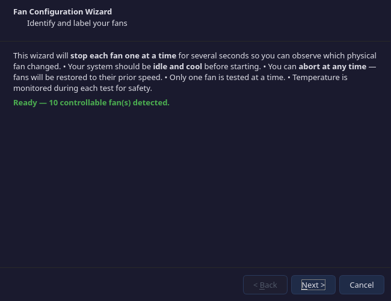

# Fan Wizard

The Fan Configuration Wizard helps you identify and label your fans. It stops each fan one at a time so you can observe which physical fan changed, then assign a meaningful name.

## Why Use the Wizard?

Fan hardware IDs like `openfan:ch03` or `hwmon:it8696:pci0:pwm1:CHA_FAN1` are not helpful for daily use. The wizard lets you assign labels like "Rear Exhaust" or "CPU Cooler" that appear everywhere in the GUI — dashboard, controls, diagnostics, and profile editing.

## How It Works

The wizard has four steps:

### Step 1: Introduction

Shows how many controllable fans were detected and explains the process. Your system should be **idle and cool** before starting.

### Step 2: Discovery

A checklist of all detected fans. You can deselect fans you don't want to test (e.g., if you already know which fan is which). Filter by source type (OpenFan only, hwmon only) to narrow the list.

### Step 3: Identify Each Fan

The wizard works through your selected fans one at a time:

1. **Stops the current fan** by setting its PWM to 0%
2. **Starts a countdown timer** (configurable: 5-12 seconds in Settings)
3. You **observe which physical fan stopped spinning** in your case
4. **Assign a label** using either:
   - A preset label (CPU Cooler, Rear Exhaust, Front Intake Top, etc.)
   - A custom text label
5. The fan is **restored** to its previous speed
6. The wizard moves to the next fan

A progress bar shows how many fans remain.

### Step 4: Review

A summary table of all fans and their assigned labels. Click **Finish** to save.

## Safety Features

- **Temperature monitoring**: The wizard checks CPU temperature during each test. If it exceeds 85 degrees C, the test is aborted and all fans are restored.
- **Abort at any time**: Press Cancel to immediately restore all fans to their prior speeds.
- **One fan at a time**: Only one fan is stopped at any moment.
- **Stuck fan handling**: If a fan cannot be stopped (e.g., BIOS override), you can skip it manually.
- **Lease management**: For hwmon fans, the wizard acquires a lease before writing and releases it when done.

## Settings That Affect the Wizard

| Setting | Location | Effect |
|---------|----------|--------|
| **Fan Wizard spin-down timer** | Settings > Application > Behaviour | How long each fan stays stopped (5-12 seconds) |

## Where Labels Appear

Once saved, fan labels propagate across the entire application:

- Dashboard fan table
- Dashboard chart legend
- Controls page — fan role member lists
- Diagnostics fan table
- Profile export files

Labels are stored in `fan_aliases` within your application settings and persist across sessions.

---

Previous: [Diagnostics](diagnostics.md) | Next: [Profiles and Curves Reference](profiles-and-curves.md)
