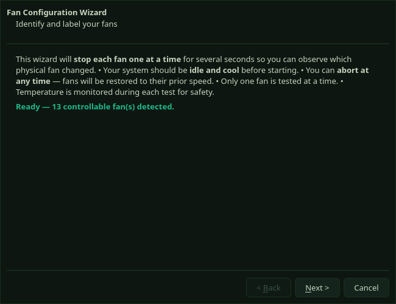

# Fan Wizard

The Fan Configuration Wizard helps you identify and label your fans. It changes one fan at a time so you can observe which physical fan responded, then lets you assign a meaningful name.

Ordinary fans are stopped briefly. A **pump is never stopped** — the daemon shifts its speed instead, so coolant keeps flowing; watch the RPM reading or listen for the change. This needs a daemon that classifies header roles (v2.28.0 or newer); against an older one the wizard says "stop" because that is what it does.

## Why Use the Wizard?

Fan hardware IDs like `openfan:ch03` or `hwmon:it8696:pci0:pwm1:CHA_FAN1` are not helpful for daily use. The wizard lets you assign labels like "Rear Exhaust" or "CPU Cooler" that appear everywhere in the GUI — dashboard, controls, the Overview page, and profile editing.

Launch it from the Controls page header: **Set up ▾** → **Auto-Connect Wizard…**.

## How It Works

### Step 1: Introduction

Explains the process and runs pre-flight checks. The **Next** button stays disabled until two hard conditions are met:

- the daemon is connected, and
- at least one controllable fan output was detected.

The intro page also checks CPU temperature: if any CPU sensor is above 85°C it shows a red **"Cannot proceed"** warning urging you to let the system idle and cool. The 85°C limit is then *enforced* at the moment a fan test starts — the wizard **aborts the individual fan test** ("too hot to test safely") rather than spinning a fan down while the CPU is hot. Your system should be **idle and cool** before running it.

When everything is in order it reports "Ready — *N* controllable fan(s) detected."

### Step 2: Liquid Cooling

Shown whenever the daemon supports header roles — including when nothing on the machine looks like an AIO yet, which is deliberate (see below).

**A pump must never be stopped to identify it.** The daemon shifts a pump's speed instead, and holds it above its safety floor — but it can only do that for a header it knows is a pump. This step is where it finds out, and it runs *before* any fan is stopped.

**What it lists.** Everything already known to be part of the cooling stack: a configured cooling device's pump, radiator fans and auxiliary fans, plus any header carrying a pump or radiator role. Each is ticked, meaning *leave this alone*. Untick anything you do want to identify — a radiator fan is an ordinary fan and is perfectly safe to stop.

**What it asks.** Which header drives your pump, and which fans are on the radiator. This is the important part on most desktop boards: many Super-I/O chips publish no header names at all, so nothing — not the daemon, not this GUI — can work out which channel the pump is on. Until you say, every header looks identical and the wizard would stop your pump looking for it.

Press **Apply** to save. This assigns the pump role (so the daemon protects it from here on, not just inside the wizard), records the cooler's layout, and re-reads both so the next step is up to date. Nothing is changed until you press it.

> If you previously named a *different* header as the pump, Apply offers to clear that older assignment and tells you exactly what protection is being removed. Decline and the old header simply keeps its role — which over-protects rather than under-protects, and is always the safe direction.

### Step 3: Detected Fans

A table of every testable fan, with a checkbox per row (all selected by default) and **Select All** / **Select None** buttons:

| Column | Meaning |
|--------|---------|
| *(checkbox)* | Include this fan in the identification run |
| **ID** | The hardware ID |
| **Source** | `openfan`, `hwmon`, or `amd_gpu` |
| **RPM** | Current measured speed |
| **Current Label** | Existing alias or daemon-supplied label |
| **Cooling** | Why this fan is excluded, when it is part of the cooling stack |

Headers reporting 0 RPM (nothing plugged in) and read-only fans (e.g. firmware-managed Intel Arc and NVIDIA GPU fans) are excluded automatically.

Anything you left ticked on the **Liquid Cooling** step is also excluded — shown greyed, with the reason in the **Cooling** column, rather than removed. You can see it was found; it just will not be touched. **Select All** skips these rather than re-arming them. To identify one after all, go **Back** and untick it there.

### Step 4: Identify Each Fan

The wizard works through your selected fans one at a time. For each fan:

1. Press **Start Test** — the fan's PWM is set to 0% so it spins down
2. A progress bar fills as the timer runs ("3 / 8 seconds", counting elapsed time upward) with a live RPM readout; press **Abort** to end the test early
3. Watch your case to see **which physical fan stopped**
4. The fan is **restored automatically** when the test period ends
5. Pick a **label** — a preset (CPU Cooler, Rear Exhaust, Front Intake Top, …) or any custom text
6. Press **Save Label & Next Fan** — or **Skip — couldn't identify** to move on without saving a label (you can re-run the test first; nothing limits retries)

### Step 5: Review Labels

A summary table (ID, Source, New Label) where every label is still editable — including for fans you skipped. Click **Finish** to save all labels, or **Cancel** to discard everything.

## Safety Features

- **Thermal abort:** CPU temperature is checked before and during every test. If any CPU sensor exceeds **85°C**, the test aborts immediately and the fan is restored.
- **One fan at a time:** the wizard asks the daemon to change only the fan you are identifying. Every other fan keeps running on its curve — there is no global pause and the daemon stays in charge throughout.
- **A pump is never stopped:** the daemon decides what "identify" means for each header from its role. An ordinary fan is stopped. A pump is *shifted* — moved clear of its current speed, upward where there is room, and never below its 30% safety floor — so coolant keeps flowing throughout. If your pump is on a header the daemon cannot classify (common on boards that publish no fan labels), tell it which header is the pump first — **Controls ▸ Set up ▾ ▸ Configure AIO** asks exactly that as its first step. Otherwise the pump is treated as an ordinary fan and stopped.
- **Daemon-enforced auto-restore:** each test is a daemon request with a built-in deadman timer, so even if the GUI closes or crashes mid-test the daemon restores that fan on its own. Finishing, cancelling, aborting a test, or closing the wizard also restore the tested fan. On restore the daemon simply removes the identify entry, and the fan resumes its normal curve control on the next daemon tick (1 Hz) — there is no separate fallback speed.

## Settings That Affect the Wizard

| Setting | Location | Effect |
|---------|----------|--------|
| **Fan Wizard spin-down timer** | Settings → Operational Behavior | How long each fan stays stopped (5–12 seconds, default 8) |

## Where Labels Appear

Once saved, fan labels propagate across the entire application:

- Dashboard fan cards and the Thermal Sensors panel
- Controls page — fan role member lists
- Overview page — fan status table
- Profile files — member labels are snapshotted into the profile JSON

Labels are stored as `fan_aliases` in `app_settings.json` and persist across sessions. Display names always prefer your alias, then the GPU model, then the OpenFan channel label (`OpenFan CH0`), then the hwmon header label, then the raw hardware ID.

You do not have to run the wizard to rename a fan. Once you know which fan is
which, you can rename one directly wherever it appears — see
[Naming your fans](dashboard.md#naming-your-fans). The wizard is for the harder
question the rename cannot answer: *which physical fan is this?*

---

Previous: [Diagnostics](diagnostics.md) | Next: [Profiles and Curves Reference](profiles-and-curves.md)
