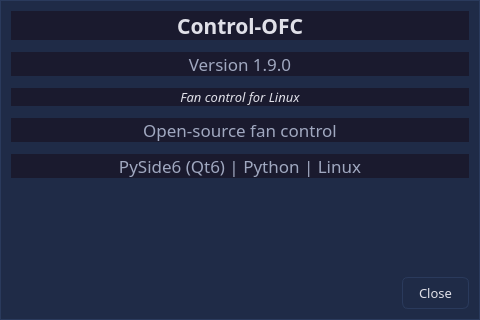

# Getting Started

## What You Need

Control-OFC requires:

- **Linux** with Python 3.12 or newer
- **control-ofc-daemon** running as a systemd service (provides the hardware interface)
- A supported fan controller (OpenFan Controller, motherboard hwmon headers, or AMD GPU)

The GUI never accesses hardware directly. All reads and writes go through the daemon's API over a local Unix socket.

### Daemon prerequisites

The daemon has its own prerequisites — kernel modules for your motherboard's
Super I/O chip, possibly an AUR DKMS driver on newer Gigabyte / MSI / ASRock
boards (2022+), and (for RDNA3+ AMD GPUs) the kernel parameter
`amdgpu.ppfeaturemask=0xffffffff`. See the
[daemon prerequisites guide](https://github.com/Plan-B-Development/control-ofc-daemon#prerequisites)
before installing the daemon — it covers BIOS settings, kernel modules,
and per-bootloader steps for the kernel parameter.

If you have already installed the daemon, the quickest way to discover
what your specific system needs is to launch the GUI and open
**Diagnostics → Troubleshooting → Hardware Readiness** — it inspects your hardware
and recommends the exact AUR packages or kernel parameters required.

For the complete ordered path — install → verify sensors → readiness check →
drivers/BIOS/GPU branch → verify control → first profile — follow the
[Setup Checklist](setup-checklist.md).

New to Linux and told you need a driver? The [Driver Setup](driver-setup.md)
page of this manual is a copy-paste beginner walkthrough — identify the
chip, install the right DKMS package, verify it works, and roll it all
back if needed.

## Installation

### Arch Linux (AUR)

```bash
paru -S control-ofc-gui
```

(Any AUR helper works — `yay -S control-ofc-gui` does the same thing.)

> **Tip — first-time AUR install UX:** paru pages the `PKGBUILD` and `.install`
> through `less` and asks you to confirm before building. That is paru's
> default security review (press `q` to exit the pager, then `y` to proceed),
> not specific to this package. To install non-interactively, pass
> `--skipreview` to paru (`paru -S --skipreview control-ofc-gui`), or add
> `SkipReview` to the `[options]` section of `~/.config/paru/paru.conf`.

### From Source

```bash
git clone https://github.com/Plan-B-Development/control-ofc-gui.git
cd control-ofc-gui
pip install -e ".[dev]"
```

## First Launch

```bash
control-ofc-gui
```

On first launch, Control-OFC will:

1. Attempt to connect to the daemon at `/run/control-ofc/control-ofc.sock`
2. If the daemon is reachable, fetch hardware capabilities and begin polling
3. If the daemon is not reachable, show a "Disconnected" state (or enter demo mode if configured)
4. Open the **Dashboard** page

### Demo Mode

If you want to explore the interface without hardware or a running daemon:

```bash
control-ofc-gui --demo
```

Demo mode generates synthetic sensor temperatures and fan speeds. All features work identically — you can create profiles, edit curves, and test the full UI. A **DEMO** badge appears in the status banner so you always know when synthetic data is being shown.

You can also enable "Start in demo mode when daemon is unavailable" in Settings so the GUI falls back to demo automatically.

## The Status Banner

The horizontal banner at the top of every page shows:

| Element | Meaning |
|---------|---------|
| **Connection indicator** | Green "Connected", yellow "Degraded", or red "Disconnected" |
| **Profile name** | The currently active fan profile, or "No profile" |
| **Mode** | "Automatic" (curve-driven), "Manual Override", "Read-only", or "Demo mode" |
| **Warning count** | Number of active warnings (click to view details) |
| **DEMO badge** | Visible only in demo mode |

> If the daemon's API version does not match the version this GUI was built for (an out-of-lockstep package upgrade), the Dashboard shows a warning banner asking you to align the `control-ofc-daemon` and `control-ofc-gui` package versions. This is non-fatal — the GUI keeps working — but some features may misbehave until the versions match.

## Navigation

The left sidebar provides access to all four pages:

| Page | Purpose |
|------|---------|
| **Dashboard** | At-a-glance monitoring: temperatures, fan speeds, charts |
| **Controls** | Profile management, fan grouping, curve editing |
| **Settings** | Application preferences, themes, backup/restore |
| **Diagnostics** | Daemon health, sensor freshness, logs |

An **About** button at the bottom of the sidebar shows version and credit information:



---

Next: [Setup Checklist](setup-checklist.md)
