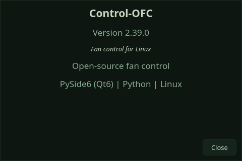

# Getting Started

## What You Need

Control-OFC requires:

- **Linux** with Python 3.12 or newer
- **control-ofc-daemon** running as a systemd service (provides the hardware interface)
- A supported fan controller (OpenFan Controller, motherboard hwmon headers, or AMD GPU)

The GUI never accesses hardware directly. All reads and writes go through the daemon's API over a local Unix socket.

### Daemon prerequisites

The daemon has its own prerequisites — kernel modules for your motherboard's
Super I/O chip, possibly an AUR DKMS driver on newer Gigabyte / MSI / ASRock
boards (2022+), and (for RDNA3+ AMD GPUs) the kernel parameter
`amdgpu.ppfeaturemask=0xffffffff`. See the
[daemon prerequisites guide](https://github.com/Plan-B-Development/control-ofc-daemon#prerequisites)
before installing the daemon — it covers BIOS settings, kernel modules,
and per-bootloader steps for the kernel parameter.

If you have already installed the daemon, the quickest way to discover
what your specific system needs is to launch the GUI and open the
**System State** page — its **Hardware Readiness** report inspects your hardware
and recommends the exact AUR packages or kernel parameters required.

For the complete ordered path — install → verify sensors → readiness check →
drivers/BIOS/GPU branch → verify control → first profile — follow the
[Setup Checklist](setup-checklist.md).

New to Linux and told you need a driver? The [Driver Setup](driver-setup.md)
page of this manual is a copy-paste beginner walkthrough — identify the
chip, install the right DKMS package, verify it works, and roll it all
back if needed.

Want the bigger picture first? [Understanding Motherboard Fan Control](understanding-fan-control.md)
is a plain-English primer on how Linux controls motherboard fans — hwmon,
Super I/O chips, drivers, and BIOS settings — and why each setup step is
asked of you. Using an [OpenFan Controller](openfan-controller.md)? That
USB fan controller has its own page covering detection, permissions, and
troubleshooting.

## Installation

### Arch Linux — signed pacman repository (recommended)

Set it up once; both packages then upgrade with your normal `sudo pacman -Syu`.

```bash
# 1. trust the signing key
curl -fsSL https://raw.githubusercontent.com/Plan-B-Development/pacman-repo/main/keys/control-ofc.gpg \
  | sudo pacman-key --add -
sudo pacman-key --lsign-key 4AAD6D2DE40D0D10773BF770BC27C5EB2831FCDA

# 2. add the repository
sudo tee -a /etc/pacman.conf <<'EOF'

[control-ofc]
SigLevel = Required
Server = https://github.com/Plan-B-Development/pacman-repo/releases/download/repo
EOF

# 3. install — the daemon comes along as a dependency
sudo pacman -Sy control-ofc-gui
sudo systemctl enable --now control-ofc-daemon
```

`SigLevel = Required` means pacman refuses any package or database not signed by
that key. Details, upgrade and removal instructions:
[Plan-B-Development/pacman-repo](https://github.com/Plan-B-Development/pacman-repo).

### One-off install, without touching `pacman.conf`

Every release also attaches the same clean-room-built package the CI pipeline
verifies:

```bash
gh release download --repo Plan-B-Development/control-ofc-daemon --pattern '*.pkg.tar.zst'
gh release download --repo Plan-B-Development/control-ofc-gui    --pattern '*.pkg.tar.zst'
sudo pacman -U ./control-ofc-daemon-*.pkg.tar.zst ./control-ofc-gui-*.pkg.tar.zst
```

Upgrading then means repeating those commands — which is the chore the
repository above exists to remove.

> **The AUR package is no longer updated.** `control-ofc-gui` was published to
> the AUR through v2.34.0 and is frozen there. If you installed with
> `paru -S control-ofc-gui`, either path above upgrades it in place — it is the
> same package name, so pacman simply replaces the AUR copy. This applies to
> *this* package only; the out-of-tree DKMS drivers on the
> [Driver Setup](driver-setup.md) page are separate third-party AUR packages
> and are still installed from the AUR.

### From Source

```bash
git clone https://github.com/Plan-B-Development/control-ofc-gui.git
cd control-ofc-gui
pip install -e ".[dev]"
```

## First Launch

```bash
control-ofc-gui
```

On first launch, Control-OFC will:

1. Attempt to connect to the daemon at `/run/control-ofc/control-ofc.sock`
2. If the daemon is reachable, fetch hardware capabilities and begin polling
3. If the daemon is not reachable, show a "Disconnected" state (or enter demo mode if configured)
4. Open the **Dashboard** page

### Demo Mode

If you want to explore the interface without hardware or a running daemon:

```bash
control-ofc-gui --demo
```

Demo mode generates synthetic sensor temperatures and fan speeds. All features work identically — you can create profiles, edit curves, and test the full UI. A **DEMO** badge appears in the status banner so you always know when synthetic data is being shown.

You can also enable "Start in demo mode when daemon is unavailable" in Settings so the GUI falls back to demo automatically.

## The Status Banner

The horizontal banner at the top of every page shows:

| Element | Meaning |
|---------|---------|
| **Connection indicator** | Green "Connected", yellow "Degraded", or red "Disconnected" |
| **Profile name** | The currently active fan profile, or "No profile" |
| **Mode** | "Automatic" (curve-driven), "Read-only", or "Demo mode" |
| **Warning count** | Number of active warnings. Clickable on **every** page — click it to jump to the **Logs** page, the single surface that lists them |
| **DEMO badge** | Visible only in demo mode |

> If the daemon's API version does not match the version this GUI was built for (an out-of-lockstep package upgrade), the Dashboard shows a warning banner asking you to align the `control-ofc-daemon` and `control-ofc-gui` package versions. This is non-fatal — the GUI keeps working — but some features may misbehave until the versions match.

## Navigation

The left sidebar provides access to all of the application's pages:

| Page | Purpose |
|------|---------|
| **Dashboard** | At-a-glance monitoring: temperatures, fan speeds, charts |
| **Overview** | Daemon health, device discovery, and live sensor and fan status |
| **Controls** | Profile management, fan grouping, curve editing |
| **System State** | Hardware Readiness report: chip and driver detection, PWM and GPU fan verification |
| **Hardware** | Daemon readiness checklist and Super-I/O architecture |
| **Settings** | Application preferences and backup/restore |
| **Theme** | Fonts, sizes, and the colour-token editor |
| **Logs** | Event log and support-bundle export |

An **About** button at the bottom of the sidebar shows version and credit information:



---

Next: [Setup Checklist](setup-checklist.md)
