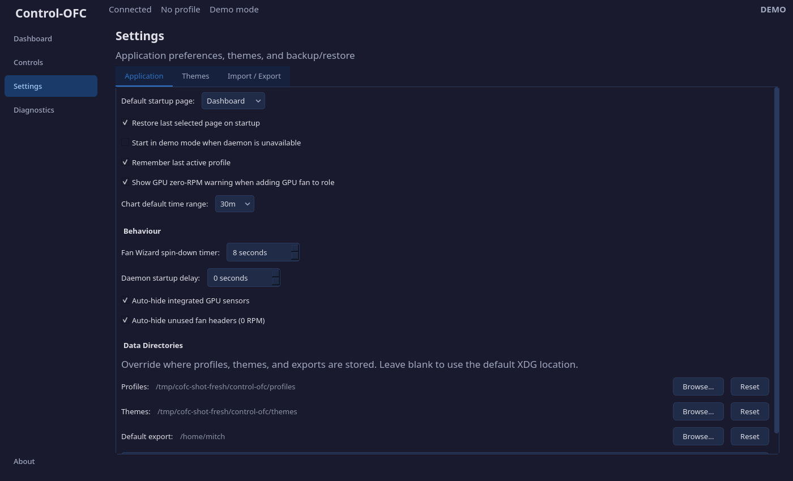
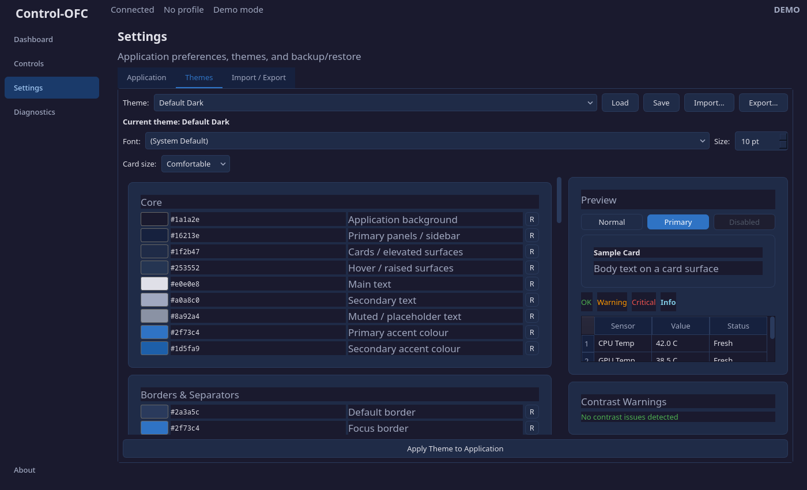
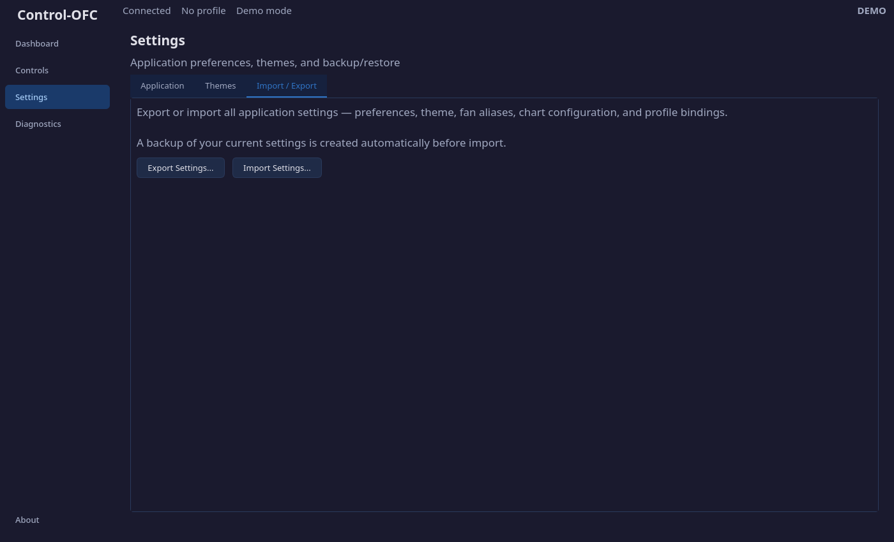

# Settings

The Settings page manages application preferences, visual themes, and backup/restore. It has three tabs.

## Application Tab

### Startup

| Setting | Default | Description |
|---------|---------|-------------|
| **Default startup page** | Dashboard | Which page the application opens to on launch |
| **Restore last selected page on startup** | On | Instead of using the default, return to whichever page you were on when you last closed the app |
| **Start in demo mode when daemon is unavailable** | Off | Automatically enter demo mode with synthetic data if the daemon cannot be reached at startup |
| **Remember last active profile** | On | Restore the previously active profile on next launch |

### Display

| Setting | Default | Description |
|---------|---------|-------------|
| **Fun mode (cheeky microcopy)** | On | Enables playful text throughout the interface. Turn off for a more professional tone |
| **Show splash screen on startup** | On | Display the branded splash screen while the application loads |
| **Show GPU zero-RPM warning** | On | When you add a GPU fan to a fan role, show an informational popup explaining that the GPU's zero-RPM idle mode will be temporarily disabled while the curve is controlling it |
| **Chart default time range** | 30m | The initial time window shown on the Dashboard fan speed chart |

### Behaviour

| Setting | Default | Range | Description |
|---------|---------|-------|-------------|
| **Fan Wizard spin-down timer** | 8 seconds | 5-12s | How long each fan is stopped during the Fan Wizard identification test. Longer gives more time to observe which fan changed |
| **Daemon startup delay** | 0 seconds | 0-30s | Tells the daemon to wait this many seconds after boot before detecting hardware. Useful if your fan controller initializes slowly. This setting is sent to the daemon and requires a daemon restart to take effect |
| **Auto-hide integrated GPU sensors** | On | — | When both an integrated GPU (iGPU) and a discrete GPU (dGPU) are present, hide the less-useful iGPU temperature sensors from the Dashboard and Diagnostics |
| **Auto-hide unused fan headers** | On | — | Hide motherboard fan headers that report 0 RPM, indicating no fan is plugged into that header |

### Data Directories

These let you override where the application stores its data. Leave blank to use the default XDG-compliant locations (`~/.config/control-ofc/`).

| Directory | Default | Description |
|-----------|---------|-------------|
| **Profiles** | `~/.config/control-ofc/profiles/` | Where fan profile JSON files are saved. If you change this, the GUI can optionally move existing profiles to the new location |
| **Themes** | `~/.config/control-ofc/themes/` | Where custom theme files are stored |
| **Default export** | Home directory | The default save location when exporting settings or support bundles |

When you change the Profiles directory, the GUI also registers the new path with the daemon so it can find profiles for headless activation.

Click **Save Application Settings** to persist all changes.

## Themes Tab

The Themes tab manages the visual appearance of the entire application.

### Theme Selection

The dropdown lists the built-in **Default Dark** theme plus any custom themes saved in your themes directory. Use the buttons to:

| Button | Action |
|--------|--------|
| **Load** | Load the selected theme into the editor |
| **Save** | Save the current editor state as a theme file |
| **Import** | Import a theme from an external `.json` file |
| **Export** | Export the current theme to a `.json` file |

### Typography

| Setting | Description |
|---------|-------------|
| **Font** | Choose from any system font, or "(System Default)" |
| **Size** | Base font size from 7pt to 16pt (default 10pt) |

### Theme Editor

The colour token editor lets you customise individual colour values for backgrounds, text, accents, status indicators, and borders. Each token controls a specific aspect of the UI.

Click **Apply Theme to Application** to apply your changes live. The entire interface updates immediately.

## Import / Export Tab

This tab provides full backup and restore of all application state.

### What Gets Exported

A single JSON file containing:

- All application settings (startup, display, behaviour, data directories)
- Fan aliases
- Chart preferences (hidden series, sensor bindings, colours)
- All saved profiles
- All custom themes

### Import Behaviour

When importing:

1. A timestamped **backup** of your current settings is created automatically
2. Settings are applied and the UI refreshes
3. Profiles from the export are written to disk (you are asked before overwriting existing ones)
4. Custom themes from the export are copied to your themes directory

This makes it safe to experiment — you can always restore from the auto-backup.

---

Previous: [Controls](/manual/controls.md) | Next: [Diagnostics](/manual/diagnostics.md)
