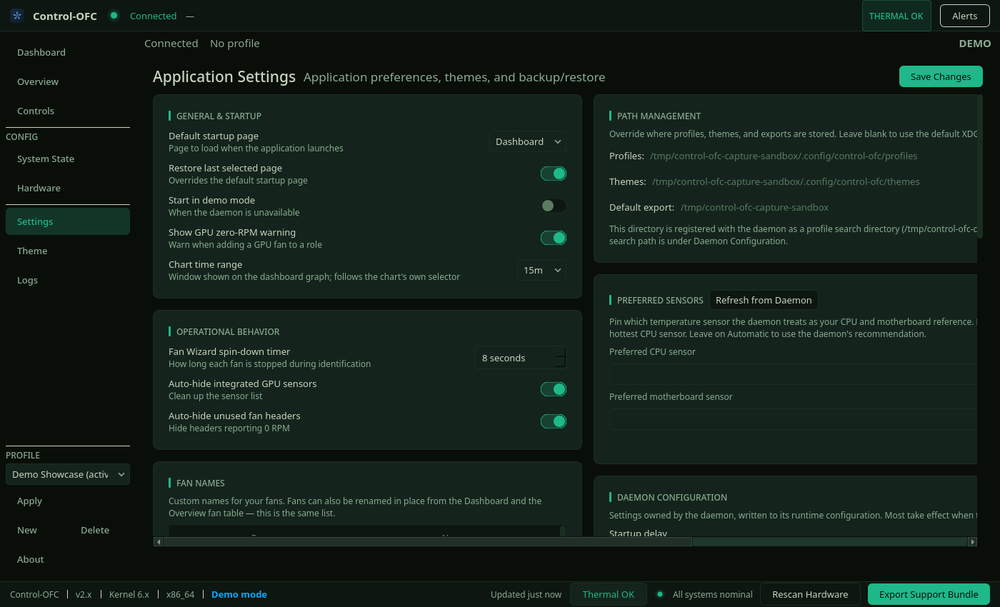
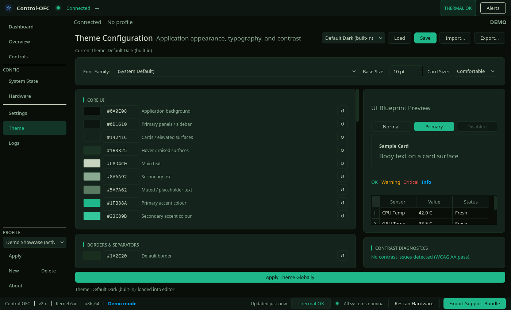

# Settings

The Settings page collects the application's own preferences — startup, behaviour, file locations, preferred sensors, and backup. It is a single scrolling surface of **cards** laid out in two columns; boolean options are shown as iOS-style **toggle switches**. Changes are batched: edit as many cards as you like, then click **Save Changes** in the page header to persist them all at once.

Visual appearance (themes, fonts, colours) has its own **[Theme page](#theme-page)**, and full backup/restore lives in the **Sync & Backup** card below.

> **In demo mode, nothing on this page is written to disk.** Changes apply for the
> session so you can see what they do, but the settings file is left untouched —
> demo's synthetic hardware ids match real ones, so a demo session is never
> allowed to overwrite your real configuration.

## General & Startup

| Setting | Default | Description |
|---------|---------|-------------|
| **Default startup page** | Dashboard | Which page the application opens to on launch, used when "Restore last selected page" is off |
| **Restore last selected page on startup** | On | Instead of using the default, return to whichever page you were on when you last closed the app |
| **Start in demo mode when daemon is unavailable** | Off | At startup the GUI probes the daemon; if it cannot be reached (and this is on) the GUI starts in demo mode with synthetic data. A slow-to-respond daemon is treated as present. Applies at launch only — a mid-session disconnect uses the normal reconnect path |
| **Show GPU zero-RPM warning** | On | When you add a GPU fan to a fan role, show an informational popup explaining that the GPU's zero-RPM idle mode will be temporarily disabled while the curve is controlling it |
| **Chart default time range** | 15m | The initial time window shown on the Dashboard telemetry chart (choices: 30s, 2m, 5m, 10m, 15m, 20m, 30m, 1h, 2h) |

## Operational Behavior

| Setting | Default | Range | Description |
|---------|---------|-------|-------------|
| **Fan Wizard spin-down timer** | 8 seconds | 5-12s | How long each fan is stopped during the Fan Wizard identification test. Longer gives more time to observe which fan changed |
| **Daemon startup delay** | 0 seconds | 0-30s | Tells the daemon to wait this many seconds after boot before detecting hardware. Useful if your fan controller initializes slowly. This setting is sent to the daemon and requires a daemon restart to take effect |
| **Auto-hide integrated GPU sensors** | On | — | When both an integrated GPU (iGPU) and a discrete GPU (dGPU) are present, hide the less-useful iGPU temperature sensors from the Dashboard and the Overview page's sensor lists |
| **Auto-hide unused fan headers** | On | — | Hide motherboard fan headers that report 0 RPM, indicating no fan is plugged into that header |

## Path Management

These let you override where the application stores its data. Each row has a **Browse…** button and a **Reset** button (which returns it to the default XDG location). Leave blank to use the defaults (`~/.config/control-ofc/`).

| Directory | Default | Description |
|-----------|---------|-------------|
| **Profiles** | `~/.config/control-ofc/profiles/` | Where fan profile JSON files are saved. If you change this, the GUI can optionally move existing profiles to the new location |
| **Themes** | `~/.config/control-ofc/themes/` | Where custom theme files are stored |
| **Default export** | Home directory | The default save location when exporting settings or support bundles |

When you change the Profiles directory, the GUI also registers the new path with the daemon so it can find profiles for headless activation.

## Preferred Sensors

If your system exposes several CPU or motherboard temperature sensors, you can pin which one the daemon treats as the reference for each. Pick a **Preferred CPU sensor** and **Preferred motherboard sensor** from the drop-downs — the daemon's own recommendation is marked with a ★, and **Automatic (recommended)** hands the choice back to the daemon's auto-pick. Selections apply immediately and are saved by the daemon (shared across every client), so there is no separate Save step for this card.

This is **advisory only**: thermal safety always uses the hottest CPU sensor regardless of your choice. The drop-downs populate from the daemon the first time you open Settings; on a daemon that predates this feature the card reports that it is unavailable. You can also set a preferred sensor straight from a sensor row on the **Overview** page (right-click → *Set as preferred…*).

Requires `control-ofc-daemon` ≥ v2.6.0.

## Resets & Maintenance

Several cards collect the things that accumulate quietly as you use the application. Each control shows a count and is disabled when there is nothing to do — the count is how you find out the state exists at all.

| Card | What it clears |
|---|---|
| **Fan Names** | Every fan name in one place, including names for hardware that is no longer plugged in. Those rows are kept on purpose: otherwise a stale name could never be removed. Renaming from the Dashboard or the Overview fan table is unchanged |
| **Sensors & Chart Series** | Hidden sensors, coolant classification overrides, custom chart colours, hidden chart series — and **Settings for missing hardware** (below) |
| **Prompts & Dismissals** | Re-arms the AIO pump popup, dismissed driver advisories, the daemon profile-import offer, and the one-time fan-name and chart-series seeding |
| **Card Layout** | Every Controls-page card size at once. Resetting one card by double-clicking its grip is unchanged |

### Settings for missing hardware

Chart colours and hidden-series entries are stored per fan and per sensor. Swap a GPU, unplug a fan, or change a kernel that renames a sensor, and those entries stay behind — the chart quietly ignores them, but they are still in your settings file. **Remove (N)** counts them and clears them.

Nothing is removed unless you ask, and the reason is that the application genuinely cannot tell the difference between hardware that is gone and hardware that is merely switched off. A fan that is stopped, or a sensor the daemon has temporarily set aside because it cannot be read (a WiFi temperature with the radio off is the usual one), looks exactly like hardware that has been removed. Deleting those automatically would lose your colours the next time you booted with a device idle. The button is also disabled while disconnected, when the application knows of no hardware at all.

**Fan names are deliberately not included.** Use the Fan Names card for those — it is the surface built for it, and a fan's name also feeds the minimum-speed rule that protects CPU coolers and pumps, so it is not something to clear in bulk by accident.

## Sync & Backup

This card (formerly the Import/Export tab) provides full backup and restore of all application state, plus a one-click push of your local profiles into the daemon. A **backup is created automatically before any import**.

### What Gets Exported

**Export Config** writes a single **portable** JSON file with your shareable configuration:

- Application preferences (startup, general, and operational settings)
- Fan aliases and hidden chart series
- All saved profiles
- All custom themes

Machine-specific state is deliberately **excluded** so the file is safe to share or move between machines: window geometry, last page, data-directory overrides, the default export directory, per-series chart colours, card sizes and card/sensor bindings, fan-zone ordering, hidden sensor rows, sensor-class overrides, dismissed kernel warnings, and the one-time profile-import flag. A full snapshot of everything (for same-machine debugging) lives in the **Logs** page's support bundle instead.

### Import Behaviour

**Import Config** restores from a previously exported file:

1. The file is validated; a malformed or unsupported file is rejected with a clear message and nothing changes
2. A timestamped **backup** of your current settings is created automatically
3. Imported preferences are **merged** onto your current settings — your local machine-specific state (window size, data-directory overrides) is preserved, and directory overrides plus the daemon startup delay are applied immediately
4. Profiles from the export are written to disk (you are asked before overwriting existing ones); invalid profiles are skipped and counted
5. Custom themes are copied to your themes directory; a theme containing an invalid colour is skipped

This makes it safe to experiment — you can always restore from the auto-backup. Some preferences (theme, chart range, aliases) take effect on the next launch.

### Importing Your Profiles into the Daemon

If you run a daemon that owns its own profile store (v1.19 or newer), the
**Sync Local Profiles to Daemon** button copies your local fan profiles
(`~/.config/control-ofc/profiles/`) into the daemon so it can manage them
directly. The first time the GUI connects to a capable daemon and finds local
profiles it offers this automatically; you can also run it any time from this card.

- Your local copies are **left untouched** — the import only ever reads them.
- Profiles already in the daemon are **skipped**; choose **import as copies** to
  bring them in under a renamed copy (e.g. *Quiet (imported)*) instead.
- A profile that fails validation is **quarantined** with a reason and listed in
  the report, without stopping the rest of the import.
- Re-running is safe: profiles already imported are matched by id and skipped.

The button acts only against a daemon that advertises profile storage; against an
older daemon it does nothing.

## Theme page

The **Theme** page is a separate entry in the sidebar (not part of Settings). It controls the visual appearance of the entire application — typography, colour tokens, and contrast — and is the only place that writes theme changes.

### Theme selection

A dropdown in the page header lists the built-in themes plus any custom themes saved in your themes directory, with four buttons:

| Button | Action |
|--------|--------|
| **Load** | Load the selected theme into the editor |
| **Save** | Save the current editor state as a theme file |
| **Import…** | Import a theme from an external `.json` file |
| **Export…** | Export the current theme to a `.json` file |

### Typography and cards

| Setting | Description |
|---------|-------------|
| **Font** | Choose any system font, or "(System Default)" |
| **Base Size** | Base font size from 7pt to 16pt (default 10pt) |
| **Card Size** | Density of the Fan Role and Curve cards on the Controls page: **Compact**, **Comfortable** (default), or **Large**. Cards already scale with the font size — this preference multiplies that scaling. (This control moved here from Settings.) |

### Colour editor and preview

The colour-token editor lists every theme token — backgrounds, text, accents, status indicators, borders, and the chart-series palette — grouped by purpose. Each token has a clickable colour swatch **and an editable hex field beside it**: click the swatch to pick a colour, or type a hex value directly.

Alongside the editor a live **UI Blueprint Preview** renders representative widgets in the current colours, and a **contrast diagnostics** line flags any text/background pairing that fails **WCAG AA** (reading "No contrast issues detected (WCAG AA pass)." when everything passes).

Click **Apply Theme Globally** to apply your edits live — the entire interface updates immediately.

---

Previous: [Controls](controls.md) | Next: [Diagnostics](diagnostics.md)
